# Introduction to Neural Network

## What is Deep Learning?
- Deep Learning is basically a field of study where in we use something known as neurons for traing the data.
- for example, we teach a baby how to identify the cat or dog or car.
- Automated Feature Engineering.
- In Machine Learning need data in feature space such as x1, x2, x3... 
- Where as Deep Learning No need of Featurization.
- Deep Learning can Extract the feature from Image, Text, Tabula data, Audio, Video, etc. it automatically extract information.
> **New Definition:** Deep Learning is basically a mathematical techinique that enable us to extract infromation from any kind of structured/unstructured data using the concept of neuron.

- $$ Y = f(x) $$ 
    
    This data(x) can be Tabular/graph/video/Audio/Text/Image etc; we can give any kind of data and we can do any kind of prediction. the only kind we need to understand which architure of f or which deep learning techinique we should use in this case, this is the power of Deep Learning.
- if we design is arthitecure of f in proper manner, we can solve any kind of problem.

- Q. You are saying that data can be anything, but you also saying that function the deep learning algorithm should be articureize according to the data, can you tell what type of data vs what type of archtecure works.
- ans. that is why different deep learning techinques exist.

## Different Deep Learning Techinques.
1. **Artifical Neural Network** - This type of neural network are design to extract infomation from tabular data. like csv file.
2. **Convolution Neural Network** - This type of neural network are design to extract infomation from image data.
3. **Recurent Neural Network(LSTM/GRU/Transformers)** - This type of neural network are design to extract information from squence data(like text, audio, Videos).
    - RNN has many class model such as LSTM(long short term memeory/GRU)
    - Tranformers are like a part of RNN for Squence data. ex - chatGPT
4. **Graph Neural Network** - for Graphs(molecule)

### Multi-Modality: 
- Multi-Modality is a concept where single functioncan take data from multiple sources, I can take tablular data, image data, text data together, etc. not the enemble or average out of model, together mean join of all the data.
- All the infromation from multiple possible resouces, just like human brain, our brain is desion multi-modal. 
- for example; To understand anything I can use visual, i can see the object, I can smell etc.
- taking infomation from multiple sources.
- think of medical data; test, X-rays, ECG(time series data) that is what multi-modelity. make decision depended on the differnt join input.

#### important points
- take text --> generate an image(stable deffusion model)
- take image --> generate the text (captioning model)
- take text --> and generate a video(Runway company doing that)

### Why Deep Learning vs Machine Learning?
- for example: predicting secand hand car24, you are not only using tablular data but also image of car, inspection command, service history, or other comments. to pridict the price of second hand car. which machine learning can not do, this is the beauti of deep learning.

#### Desision Tree also partiting the data neural network also partiting the data it is like a black box, but we know that how decision tree partiting, verticle lines and horizontal line, but we don't know, how neural network is partiting the data, it is partiting in small small peaces and find the curve. (but there are way to tell us)

### Why the non-linearlity is absolutely vital?

<p align="center">
  
</p>

$$
 n_1 = x_1w_1 + x_2w_2 + wo 
$$

$$
 n_2 = x_1w_3 + x_2w_4 + wo
$$

$$
    w_1, w_2, w_3, w_4 --> these thing decide my slope, and when it pass to the non-linearity it will decide my curvature
$$

$$
 y^{ \wedge } = w_5n_1 + w_6n_2 + wb
$$

$$
 y^{ \wedge } = w_5(x_1w_1 + x_2w_2 + wo) + w_6(x_1w_3 + x_2w_4 + wo) + wb
$$

$$
 y^{ \wedge } = w_5x_1w_1 + w_5x_2w_2 + w_5wo + w_6x_1w_3 + w_6x_2w_4 + w_6wo + wb
$$

- collect all the x1, x2, wb

$$
 y^{ \wedge } = x_1(w_5w_1 + w_6w_3) + x_2(w_5w_2 + w_6w_4) + w_5wo  + w_6wo + wb
$$

- it's a line:

$$
 y^{ \wedge } = x_1A + x_2B + C
$$

- if we add any kind of non linearity then the megic will happen.
- this is the beauti, 1 neuron doing the simple task but when you join simple, simple, ... task to data i will become big and solve bigger problem.

$$
 n_1 = \tanh\left(x_1w_1 + x_2w_2 + wo\right)
$$

$$
 n_2 = \tanh\left(x_1w_3 + x_2w_4 + wo\right)
$$

- That is a single curvatue of the a line can fit any decision boundary

## How do we train such a network of neurons:
1. Intilise the architecure (define the number of hidden layers, neurons etc)
1. Randomly Intilise the weight
1. Given the weights calculate the loss:-
    * how do i calculate the loss of regression problem? 
        MSE = (1/n) * Σ(yᵢ - ŷᵢ)²
        Where:
        - n is the number of observations,
        - yᵢ is the actual value for the i-th observation,
        - ŷᵢ is the predicted value for the i-th observation.
1. Given the loss, update the weithts- Gradient Descent Algorithm + Chain Rule
1. using the updated weights go to step3 and keep on doing it till you stablise your training loss to the min possible(min val loss)

# Gradient Descent Algothim and Chain Rule
- Gradient will have some problems and that where we will be learning optimizers; it is meant to improve the gradient descent problem.


## what is the job of single Neuron?
> Neuron get some input along with the weights and bias and generate some output.

## what exactly a neural network?
- Neural network a basically a concept where in we are connecting multiple small small mathematic unit together in such a way they can fit any kind of decision boundry. 
- the way it is doing, the one neuron is resposible for small single job.
- one neuron is doing a very simple job.
- the objective of one neuron in life is, that i certain inputs comming inside me and i give them certain weight, i combine inputs with weights and bias to generate some output.
- y = x1xW1 + x2xW2 + w0 
- neuron is resposible for decision boundary
- you need to design a framework that i can form any kind of non-linearity, given any kind of function i can fit that or any kind of dimension.
- this can acheive be only acheive by 2 things, one is that if i divide the entire boundary in small small subsegments and each subsegment is single non-linearity then at a network i can fit a complex decision boundary.

### why the non-linerity is absolutely vital?
- it is difficult for me to estimate the boundary in totality, but it is easier for me to estimate in joing diffent differnt curve.

### Question: I understood that we have some input varible which multiply by some weights and again in hidden layer it again multiply by some weights and product some output. How can this weight is find out?
- it is solved by gradient descent

## How do we train such a network of neurons?
 1. Initalise the architecure(define the number of hidden layers, neurons etc)
 1. Randomly initialise the weights
 1. Given the weights calculate the loss
 1. Given the loss, update the weights- Gradient descent Algorithm + Chain Rule
 1. using the updated weights go to step 3 and keep on doing it till you stabilise your training loss to the min possible(min val loss)

(One *Forword Propagation*: given random weight we forward propagates, and get the loss. calculate from left to right)


## what is loss?
- Loss is a function that define the difference between the actural and predicted.
- basic properties of loss function-
    + should be continues
    + should be diffential
    + should be exist in such a way it has only one minimum, convex optimzation(only one minimum)
    + The Mean Squared Error (MSE) is a commonly used loss function in regression problems to measure the average squared difference between the predicted values and the actual values. This loss function is particularly useful when the goal is to minimize the average squared error of predictions.
    + The formula for Mean Squared Error is given by:

        
        

## What is the loss in binary classification
Cross-Entropy Loss, often referred to as *Log Loss*, is a widely used loss function in classification problems. It measures the performance of a classification model whose output is a probability value between 0 and 1.

### Binary Cross-Entropy Loss Formula

The formula for Binary Cross-Entropy Loss is given by:


where:

- \( N \) is the number of samples.
- \( y_i \) is the true label of the i-th sample (1 for positive, 0 for negative).
- \( \hat{y}_i \) is the predicted probability of the i-th sample being in the positive class.


### Categorical Cross-Entropy Loss Formula
For multi-class classification, the Categorical Cross-Entropy Loss is used. The formula is given by:


where:
- \( N \) is the number of samples.
- \( C \) is the number of classes.
- \( y_{i,j} \) is the indicator function (1 if sample \( i \) belongs to class \( j \), 0 otherwise).
- \( \hat{y}_{i,j} \) is the predicted probability of the i-th sample belonging to class \( j \).

#### Interpretation
- Cross-Entropy Loss is used to measure the dissimilarity between the true distribution and the predicted distribution.
- Lower Cross-Entropy Loss values indicate better model performance.

#### Considerations
- Cross-Entropy Loss is sensitive to the correctness of class probabilities predicted by the model.
- It penalizes confidently wrong predictions more than uncertain ones.

### forward propagation and backword propagation
+ given the weight calculate the loss, is called forward propagation
+ given the loss update the weight, is called backward propagation

### How to update the weight, is there any logic behind how to update the weight or any algorithm is there to update the weights. 
- There is an algorithm that is called Gradient Descent Algorithm

## Grandient Descent Algorithm
+ given the loss how do i update the weight for regression problem, for classification problem and for multiclass classification problem.
+ Loss is the function which are present in multi-dimenstion; how many dimention; number of weights and bias
+ starts with random weights

+ so from here, we calculate the partical derivties of loss with respect to w1
    - what is partical derivates; if the increse our w1 slightly, w1+dw, what will happen to my loss.
    - DL/w1: optimize in the direction of w1
    1. in case of regression problem - [output: linear acivation function], [LOSS: MSE]
    1. in case of classification problem(binary) - [output: sigmoid], [LOSS: binary Log Loss]
    1. in case of Multi-classification problem - [output: softmax], [LOSS: multiclass logloss]
        * One-vs-Rest - if you have 3 class in you neuron then there is 3 output, each output contain the probabilty of output.
        * but how do i make sure each of the three neuron are between 0 to 1 and all of them together add up to 1.
        * through an activation function called Softmax
        * softmax takes any value of n, not that only it return the probabilty of each output(between 0 to 1) and total add up to 1.
        
    * use one-hot-encoding not label-encoding for multiclass classification.

# Activation Functions for Different Types of Problems
## Activation Function
An activation function is a mathematical operation applied to each neuron's output in a neural network, introducing non-linearity to the model. It allows the network to learn complex patterns and relationships in the data by transforming the input signals into an output signal. Activation functions help in capturing and representing the hierarchical structures in the data, making neural networks capable of approximating complex functions and solving a wide range of problems.

## Regression Problems
- **Linear Activation Function**: Suitable for unbounded output.
- **ReLU (Rectified Linear Unit)**: Commonly used, but may not be suitable for negative predictions.
- **Leaky ReLU**: Variant of ReLU that allows a small gradient for negative inputs.
- **ELU (Exponential Linear Unit)**: Smooth alternative to ReLU, allowing negative values.
- **Tanh (Hyperbolic Tangent)**: Squashes output to [-1, 1], suitable for bounded outputs.
- **Softplus**: Smooth approximation of ReLU, allowing negative values.
- **Sigmoid**: Sometimes used when output needs to be bounded between 0 and 1.

## Binary Classification Problems
- **Sigmoid Activation Function**: Outputs a probability for the positive class.
- **Binary Step (Threshold) Activation Function**: Less common, outputs 1 or 0 based on a threshold.
- **Softmax**: Rarely used, but can be employed for binary classification with two output units.

## Multiclass Classification Problems
- **Softmax Activation Function**: Normalizes output into a probability distribution over multiple classes.
- **Sigmoid Activation Function per Class**: One-vs-all strategy, multiple sigmoid functions for each class.
- **Sparse Categorical Cross-Entropy Loss**: No activation function on output layer, combined with cross-entropy loss.
- **Softmax with Negative Log-Likelihood Loss**: Often used in frameworks like PyTorch, softmax followed by negative log-likelihood loss.


### why can't we use metrices for updating the loss?
 - Metrices are use for majoring the performance, we can not find the loss.
 - also it is not differentiable

## Tensorflow and Keras - 1 (Fri, 22 Dec 2023)
    - tool and platform that i can use my neural network at simpler way.

#### 1. Sequential API
- When input data is flow from one input to one output in a stream line way.
- one input some hidden layer and one output.
- The __Sequential model__, which is very straightforward (a simple list of layers), but is limited to single-input, single-output stacks of layers (as the name gives away).
- `one input mean 1 type of data like data having 10 features`
`When we have one image data and one tabular data there we need a functional API. here sequential api will not work here.`

#### 2. Functional API
- multiple input and multiple output
- `When we have one image data and one tabular data there we need a functional API`.
- Medical data problem, we don't only see bio marks we also see the test result, etc.
- basically multimodel model, input are coming in different way. that is why we need to import our input layer.

#### Question: Can you design this model using Keras Sequential API ?
- No, there is no way to pass two inputs to one layer in Sequential API
- We use another API of Keras called as Functional API to design such complex models

#### Why do we need Functional API instead of Sequential API?

- Functional API gives us **more flexibility**
- This API can handle **multiple inputs and outputs**
- lets say we have an image and a text description as our training data
- Or we want model to output two or more target variables
- Ex- A weather forecast model predicting Min & Max temp at the same time
- Sequential API wont be able to do this


Look at this complex model design, it can not be created using Sequential API but easily by Functional API
- Multiple inputs to one layer
- Multiple outputs of one layer

- So functional api gives us more **flexibility for network architectures**
- architectures are not always in sequential manner
- we can have two layers in parallel  
- It is always recommend to **use the simplest method while building networks**
- Simple models can be easily built with Sequential API
- But sometimes we need the flexibility


#### Sequential API
```python
from tensorflow.keras.layers import Dense
from tensorflow.keras.models import Sequential
model_sequential = Sequential([
                    Dense(16, activation="relu", input_shape=(11,), name="hidden_1"),
                    Dense(8, activation="relu", name="hidden_2"),
                    Dense(4, activation="softmax", name="output")
])
```
- Earlier we have created this model using Sequential API
- Now lets create same model using Functional API

#### Functional API
- Multiple Sources of data coming together that is way i specifically bring the input layer explicityly.
- now, what i do with this input layer, in my input layer now, i can create the input layer sapartly.
- In Sequential we passed input shape in the first layer
- But Here we will be using an additional layer : **Input layer**
- we're going to explicitly have a separate layer to represent the data input.
- so, i can create individual input layers to ingest differnt types of data in my neural network.
```python
from tensorflow.keras.layers import Input
# create an input layer with the shape of the dataframe
inp1 = Input(shape=(11,))
inp2=Input(shape=(5,))
```
### Complicated:
- I can put tabluar data, image data and text data in one single neural network and then generate the output.
- `Q. why can't we do seperatly, we train image data seperatly, we train text data seperatily and we do tabular data seperatly`
- ans - And when a new patient will come i can send the x-ray, ct-scan seperatly, i can send report seperatly and i can send precription seperatelty to the model and then take the average it and generate the average probability
### what is the Difference between ensamble model and multimodel?
- ans - `Sudipta: the model will not learn the association between each type of input if we don't use multi model approch.` <br>
- ans - the model will not learn the join distribution, given the blood report and the scan and the text together, we need to learn `join distribution` of 3 things not individual. <br>
- `ensemble will not able to learn the join distribution, it will learn conditional distribution, i will learn independent distribution.`
```
- Next we will be creating our first two layer of the model
- Instead of creating a list (as in Sequential)
- We will also pass previous layer in the current layer
- In first dense `hidden_1` we will pass `inp`
- And in second `hidden_1` we will pass `hidden_2`
```
```python
h1 = Dense(16, activation="relu", name="hidden_1")(inp1)
h2 = Dense(4, activation="relu", name="hidden_2")(h1)
out1 = Dense(4, activation="softmax", name="output")(h2)

h3=Dense(4,activation="tanh" name="hidden_3")(inp2)
out2=Dense(1, name="output")(h3)
```


- Finally,  to built a model using this directed graph
- We will use `tf.keras.models.Model`, and pass all the inputs and outputs
```python
from tensorflow.keras.models import Model
model_functional = Model(inputs=[inp1,inp2], outputs=[out1,out2], name="simple_nn")
```

using the same above architecure we can apply `regression` and `classificaiton` at one go.  <br>
- `we can stack layers in no sequential manner.` <br>
- new it is up to you what kind of problem you can solve using this arrangement of layers.


`Q. What is facial recogntion can do? we can solve the face comparision using this method.` <br>
what facial recongition do, it has an image1 and image2, both pass through same set of layers and generates two vectors and then calcuate the cosine similarity of these two vector and prediction of 1 and 0 


`Q. Image and tabular data, how it look like in multi-modality.`


`Q. Image data, tabular data and Text data multimodel`
functional api is not about join 2 or more models it is about the ability to combine two information from multiple sources/layers.


`note: Sudipto, i have given you machansim/framework now you think about the combination`

You can make inceptionnet with this framework.


`Image similarity problem`: I process the image with the same steps and generate two vectors. i can not subtract the image1 to image2 i have to learn the 1 dimentional representation of these images and then do cosine similarity. <br>
- we can not do element wise operation on this 2 image, we need to have some 1 dimentational representation then we can perform image similarity.
- we are using the same artichiture to create the 1-dimentational vector because if we use different articecture then we get different set of 1-d vectors, which cause problem when we do cosine similarity.
- that is why architecure design is thoughtfull processs i can't able to make in 1 or 2 day.
- 1-dementional vector is gold pot of that image.


> Note: it doesn't matter what kind of data you bring in, but last layer is alway be dense laye, weather it is ANN, CNN, or RNN. after doing any kind of feature extration on tabular,video, Audio, Graph, image or text it will always end up with 1-dimentional data, which can be handle by dense layer.

### Build a fuctional API
```python
from tensorflow.keras.layers import Input
inp1 = Input(shape=(11,))
inp2 = Input(shape=(5,))

h1 = Dense(16, activation="relu", name="hidden_1")(inp1)
h2 = Dense(4, activation="relu", name="hidden_2")(h1)
h3=Dense(4,activation="tanh" name="hidden_3")(inp2)

# final output
out1 = Dense(4, activation="softmax", name="output")(h2)
out2=Dense(1, name="output")(h3)
```

- We have defined the flow of the model
- Finally,  to built a model using this directed graph
- We will use `tf.keras.models.Model`, and pass all the inputs and outputs

```python
from tensorflow.keras.models import Model
model_functional = Model(inputs=[inp1,inp2], outputs=[out1,out2], name="simple_nn")
```

Let's generalize above code inside a function
```python
from tensorflow.keras.models import Model
from tensorflow.keras.layers import Input
def create_model_functional():
    inp = Input(shape=(11,))

    h1 = Dense(16, activation="relu", name="hidden_1")(inp)
    h2 = Dense(8 , activation="relu", name="hidden_2")(h1)

    out = Dense(4, activation="softmax", name="output")(h2)

    model = Model(inputs=inp, outputs=out, name="simple_nn")
    return model
```
```python
model_functional = create_model_functional()
```
```python
model_functional.summary()
```

And, optionally, display the input and output shapes of each layer in the plotted graph:

```python
tf.keras.utils.plot_model(model_functional,show_shapes=True)
```
### let's create a little complex model using functional API's with more than one output
optimizer will be same because we can not have more then 1 gradient descent to adjust the weights.
```python
def create_model_multiple_output():
  inp = Input(shape=(11,))

  h1 = Dense(16, activation="relu", name="hidden_1")(inp)
  h2 = Dense(8 , activation="relu", name="hidden_2")(h1)
  h3 = Dense(4 , activation="relu", name="hidden_3")(h2)

  out1 = Dense(1, activation="sigmoid", name="output1")(h3)
  out2 = Dense(1, activation="linear", name="output2")(h3)

  model = Model(inputs=inp, outputs=[out1,out2], name="simple_nn")
  return model

# instade of string identifier i can also provide class object
mse=tk.keras.loss.mean_squared_error()

# creating model with multiple output
model_multiple_output = create_model_multiple_output()
model_multiple_output.compile(
    optimizer = tf.keras.optimizers.Adam(learning_rate=0.001),
    loss = {"output1":"binarycross_entropy", "output2":mse}, #string identifier, class object
    metrics=["accuracy"])

# plotting model with multiple output
tf.keras.utils.plot_model(model_multiple_output,show_shapes=True)
```

#### You can make a model with multiple output with
1. the Functional API
1. by subclassing tf.keras.Model.

Here's an example of dual outputs (regression and classification) on the Iris Dataset, using the Functional API:
```python
from sklearn.datasets import load_iris
from tensorflow.keras.layers import Dense
from tensorflow.keras import Input, Model
import tensorflow as tf

data, target = load_iris(return_X_y=True)
X = data[:, (0, 1, 2)]
Y = data[:, 3]
Z = target

inputs = Input(shape=(3,), name='input')
x = Dense(16, activation='relu', name='16')(inputs)
x = Dense(32, activation='relu', name='32')(x)

# bifercate, 1 dense for regression and 1 dense for classification
output1 = Dense(1, name='cont_out')(x) #regression output
output2 = Dense(3, activation='softmax', name='cat_out')(x)  #classificition output

model = Model(inputs=inputs, outputs=[output1, output2])

model.compile(loss={'cont_out': 'mean_absolute_error', 
                    'cat_out': 'sparse_categorical_crossentropy'},
              optimizer='adam',
              metrics={'cat_out': tf.metrics.SparseCategoricalAccuracy(name='acc')})

history = model.fit(X, {'cont_out': Y, 'cat_out': Z}, epochs=10, batch_size=8)
```
during the backpropagation you have to consider for both losses net loss(J1+J2) and update the weight accordingly.<br>
you can also do 
```python
history = model.fit(X, [Y,Z], epochs=10, batch_size=8)
```
### The loss curve that we get in neural network can be very very difficult to optimize, what are the tool and technique in our pocket to make my neural network better in training.
    - Dropout,
    - Batch Normalization
    - Regulization
    - different optimzers
    - callback
    - hyperparamerter Tunning
> these are my mathematical animation so that we can create our neural network in more refine way.

## Dropout

- image a situation you are a teacher and you have 50 student, and each student has differnt IQ, differnt brain, different attension spam, let say the teacher asked a question and let's say there are 3 student in the first banch who actively answer all the question. 
- here, what happen the 3 student are training very well but other 47 student are not paying attension. 
- now you send this 50 student to a competition, what will be the performance of the class? bed right, because only 3 student do well in that group, in that competion independly they have to perform well.
- what could be teacher do to import this?
    * special attension
    * parent teacher meeting
    * extra class
- suppose:
    * Teacher - loss
    * 50 Students - neurons
    * Cold calling(randomly asking question) - Dropout


- now, some neauron have the perfect weight assign, those neuron who having the perfect weight can perform well just like first bancher and the entire set of neuron are relay on those 3 neuron for loss reduction.
- now here the teacher is feeling good, that whatever he is teaching everyone is getting well. but the teach don't know the other 47 student is not doing good.
- It mean the entire class the doing good because of 3 front bancher and minimize the loss of entire class by these 3 student. this is like training
- but when these student send to the competion then they perform really bad.
- `Note: here you are seeing that loss is reducing by the cost of other neuron not learning well. you will observer that your training loss reducing very well but you test loss is not reducing well.`
- `Basically, we are training 50 neural network but there are only 3 neural network which are responsible for reducing loss.`
- `Dropout` is local phenomena not global phenomana. dropout is apply on layer wise.
- i do a coin toss(mean it either stay or not stay in certain probability) if it come up to `head` i will drop that neuron and remove all the connection related to that neuron. <br>
    * it is like you don't have to dependent on your friend you solve it by yourself. it is forcing the neuron to get train by flowing entire information.
    * it make sure all neuron have participated in training process and there is no strong relience on one specific set of neurons, because if they where absent other guys have to learn. this crated very robust form of neural network. and make your class very stronger.
- you can also set a dropout rate(=0.3) it means that for every training there is 30% chances that the neuron get dropout and 70% changes that each neuron is not going to drop.
- after every epoch the neural network connection is back.

- every neuron participate in training.
- `Note: one neuron can learn only the one feature not entire feature`
- how many neauron we can drop in one layer is __hyperparmeter__.
- dropout rate is __hyperparmeter__ usually 0.2 or 0.3 is good.
- `Note: we can't do dense+dropout, dense + dropout, we usually do 2 or 3 dense layer then 1 dropout layer.`

* Q. if all the incoming neuron connection is 0 then that neuron is good for nothing.<br>
Ans: if the neuron weight is closer to zero then i can say it is inactive,

* `Note: dropout helps to reduces overfitting.`
* Objective of dropout:
    - every neuron should learn individually
    - without depending on other


__Add Dropout layer__
- Droping mean what all the incomming connection to that neuron and all the out going connection from that neuron are disable, it mean that neuron is not avaiable for us not there for us.
- dropout should be used in initial layer if we use dropout closer to the output layer it kind of sometime create disturance to the learning of model.
- so dropout should use in initial layer of your neural network not the final layer of your neural network.
- we can not control the dropout because dropout by design it is random, we can only control the dropout rate. it become our hyperparameter.
- and you explicly tell like how much dropout you want in a particular layer. 
- we don't design like dense layer and dropout layer, dense layer and dropout layer, it is like 2-3 dense and 1 dropout layer, 2-3 dense then dropout layer it usally work like that, to much dropout is not good.

### Implementation Dropout using Tensorflow
```python
L2Reg = tf.keras.regularizers.L2(l2=le-6)

model = Sequential([
    Dense(256, activation='relu', kernel_regularizer=L2Reg),
    Dropout(0.3), # we can introduce the dropout as a layer
    Dense(128, activation='relu', kernel_regularizer=L2Reg),
    Dropout(0.3),
    Dense(64, activation='relu', kernel_regularizer=L2Reg),
    #Dropout(0.3) # as we closer to the output we avoid using dropouts
    Dense(1, activation='sigmoid')
])
```
`Dropout layer(0.3)`: 0.3 is dropout rate, higher the dropout rate higher the propensity of neurons to get dropout, lower the propensity rate lower is changes of neurons to get dropout.

`Note: RelU is very good activation function for the very deep neural network because it will help in the gradian descent problem`

--------------------------------------------------------------
Tensorflow and keras-2
-------------------------------------------------------------
`Q. Can dropout solve overfitting problem?` <br>
Ans - dropout is not for overfitting problem, overfitting is handle by regulaization, but dropout is to make sure that the neural network that you created every neuron is balance, 
<br>-you acutally have underfitted model which needs dropout. your model is getting underfitted because not all neuron is particepting in the training process that can be also a case.

`Q. When should you opt for dropout layer? give is seanrio` <br>
Ans - Whenever you have a lot of neuron(deep neural network) and you have noise in you data then you should opt for dropout layer. 
<br>- bad loss curve are because of noises in your data. if you data do not have noise, it is very predictive then you loss curve is very very smoth in that case. 
<br>- problem arries when you data have a noise and whenever you data has noice your loss curve is wiredly shape.
<br>- And when you have lot of neuron trying to fit that noise data certain neuron get initilize into bed region of loss curve.
<br>- that's why whenever you are solve a problem which has noise data (which is almost most of the time you have noise data) and you wanted to build a deep neural network that you need a dropout layer.

`Q. Shouldn't the dropout be random, can best performance neuron drop at lower rate and low performance neuron should drop at heigher rate?`<br>
Ans - because we use dropout at initisial level so there is no concept of best performance neuron and worst perofrmace neuron.
<br> - one who participating vary strongly in gradient, we can slow him down, the neuron who is not participating at all in the loss reduction i want to boost it up, that is what the job of optimizer.

`Q. Why every neuron is not participating in learning process?` <br>
Ans - Because of bad loss curve shape due of noise in data and to avoid that we introduce the dropout. 

`Q. How can you identify the noise in you data?`
Ans - Generally, if there is gap between your training loss and validation loss, or you training loss and validation loss is not going beyound a certain degress of accuracy then your data has noice this is how to identify the noise.

`Q. What is noise?` <br>
Ans - the unpredictibily part of you data is noise.
<br>-  `noise = 100 - accuracy`, there are `reduable noise` as well as `ireducable noise`.
<br> reducable noise we can reduce by `dropout`, `regulaization`, `building more neurons` and by changing the `activation function`etc
<br>- irreducable noise you can not.

`Q. Whan one feature is over shadowing the other relevent feature, shouldn't we use the drop out to balance the impact of the feature?`<br>
Ans- yes, it is samething some neuron is over participating some neuron is not participating.

`Q. How can we understand the noise`?
Ans - loss curve help us to understand the noise.

`Q. How many neuron are drop at one iteration?`
Ans - suppose we have 10 neuron in my dense layer and we apply a dropout layer of probaliblty (0.2) it mean it go to each and every neuron and do a coin toss with a probabilty of 0.2 of droping the particular neuron.


## Regularization
`Q. Overfitting is when the performance is good at training but perform bad on test data that is called overfitting.why?` <br>
Ans - because the data point is not actually a linear but we try to estimate the linear regression. <br>

__High Variance__: `y=100+1000x1` small changes in x data big changes in y this is called high variance model <br>
__Low Variance__:  `y=0.1+10x1` this is low variance model <br>
`note: it is alway prefer weights and beta which are smaller in magnitude.` <br>
`Underfitting` - when both are score bad.

* In machine learning we have learn we apply ridge and lasso regulization in linear regression. 
`Q. but why ridge and lasso regulization is applied on linear regession line where all linear regression is simply go linearly`

* one of the biggest problem is having high variance a small changes in data is reflect big changes in output. because of high weight associated to it.

* `Note: Neural network at every stage at every neuron is basically is linear regression + some non linearity if the weight is exemilly high then the output product by that neauron is also high. this mean that the neuron is extemily sensetive towards the small changes in data.`

* we can penalize the model for go in the regions where the weight are high that's what the concept of regulaization. that why in regression is the `loss is MSE` but after apply the regulaization the `loss will be MSE+λ(penalty)`
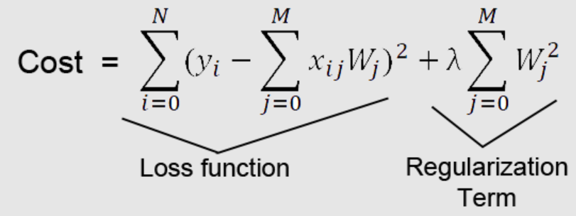

`note 1: inflate the weights such that my neuron has to build a lot of non-linear curve to fit those weights that is the decision we will have to take if there were no panalty i would have my curve as non linear as possible and fit all of the weights. so because of the panalty i kind of stop.`

`note 2: if you data does not have any noise(a points which are out of the pattern) then we don't want regulization. we always want the data to be fit completly when there is no noise`

`note 3: if the data has very high amount of noise then abously i want some regulization, not wanted to create a very twisty model by tunning the weights of each neuron possible to very very high values. so this is the concept of regulization. it is like constrain the weights(constrain optimizer)`

`Note 4: when the MSE has to reducing because you curve fitting the points you weight are bolten up during the process, and regulization is wanting to create the balance.`

In regulization, when MSE reduction is less and bloating is more then it stop.
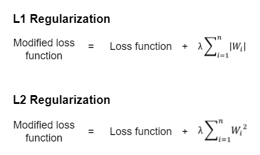
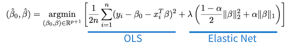

`Q. is bias and underfit not big consern in neural network?` <br>
Ans - Neural networks can always overcome underfitting because i can introduce as much neuron as i want. how every it is not completly true sometime neural networks also stuggle if we do not have right features. but generalize it do not stuggle underfitting because i can introduce those features also introduce more number of neuron.

`Q. what if you data don't have any noise will you use regulization?`
Ans - No, if my data don't have noise then you don't need regulization, because if your data don't have any noise then it is okay to fit entire curve properly.

`Q. What is regulization?`
Ans - Regulization is nothing but contrain optimization, we are saying please reduce the MSE but do not vilate these contrains 
<br>- they are soft contrain. it is not like if you go to with bloated weight i will cut you hand(example).
<br>-if you go the bloated weight i will put some panalty, i will kind of pull you back.
<br> R = MSE + Penalty

`Q. What underfit looks like in term of weights?` <br>
Ans - Underfit has low weights or lesser number of weights.

`Q. when do we introduce the regulization`?
Ans - when we see that you training loss is kind of diverging from your validation loss. then we can clearly say that our model is kind of overfitting.
<br>- in such case we introduce our regulization
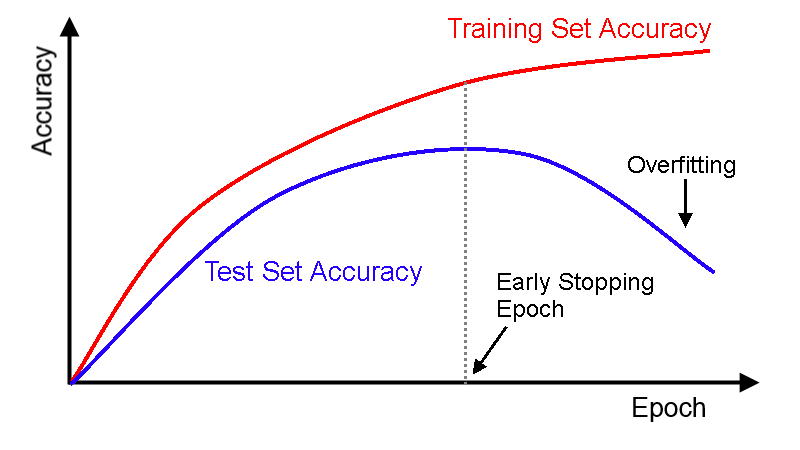
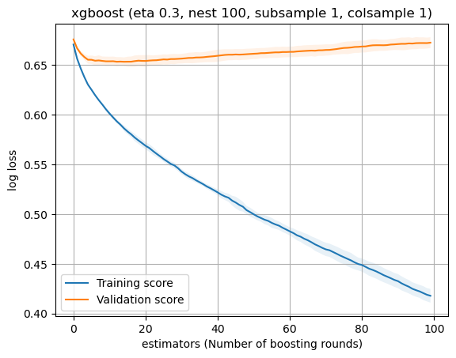

### Implement L2 regulization on your neural network using Tensorflow.
```python
# you instaicate your regulization object with the laglagius parameter
L2Reg = tf.keras.regularizers.L2(l2=1e-6)

# create a variable and feed that variable to each dense layer
Sequential([
    Dense(256, activation='relu', kernal_regularizer=L2Reg)
    Dense(128, activation='relu', kernal_regularizer=L2Reg)
    Dense(64, activation='relu', kernal_regularizer=L2Reg)
    Dense(1, activation='sigmoid')
])
```


## Mini Batch Gradient Descent
- let think about 2 schnairo
1. Schaniro 
    1. we have input x1... xp and you have y output.(1000 rows of data)
    1. we started with random weights
    1. using random weight we forward propagate calculated the y
    1. you send each row of data and you calculate each y.
    1. you calulate the total loss of the system by summing up the entire loss
    1. and difference the loss w.r.t all the weights and updated the weights using gradient descent.
    1. end of one epoch
2. schanrio
    1. you initilize with random weights
    1. let's say you have 1000 rows of data
    1. you take 100 rows of data data.
    1. using this random set of weights you forward propagate and you calculate your predicted y.
    1. after that you sum up your loss 
    1. and you update you random weights
    1. then using the revise set of weight you go and select another 100 rows of data, take the input X and find out the y, calculate the loss update the weights.
    1. now using update weight you take another 100 chunks of data send the X's, find out the y, find out the loss and update the weights.
    1. you do this 10 times and you say 1 epoch is completed

`Q. Which Schaniro is best and why?` <br>
Ans - Sechnario 2 is better
* in 2nd times, i have upate my weights 10 times in one epoch but in 1st option i have update the weight 1 times in 1 epoch.
* you might converage faster with option 2
* 2nd as the loss has been reduced 10 times
* let's consider after just using 100 rows of data i have go the better estimate of weights, using the better estimate of weights i propegate 100 chunks of data and i calcuate the loss and i back propagate. within 200 of data 2 already updated. by the time at last set of 100 rows of data my weights have already 900 rows of data already and they are updated 9 times already, some might luckey get better weights then previous some might get unluckey get even worse weight, but overall in one apoch i have reduce the reduce the weights 9 times.
* Within 1 epoch i would have acheive much lower loss as compair to the situation i update the weight only one times.
* I understand send complete data the loss curve will be smother but it will be much slower.
* in situation 2, it might be not good 1,2,3 time but it will is get better in 9th times, it mean that our model ready seen 800 of data and it is reduce 8 time and update the weights. 

`note : batch size is up to me, i can choose the batch size`
`advanatge:` 
1. Faster conversion of weights,
2. smothe weight curve
3. we can acheive the minima faster in mini-batch gradient descent, for exaple mini-batch gradient descent, we can close in 10 epoch but in gradient descent it might need 50 epoch to reach to global minima.
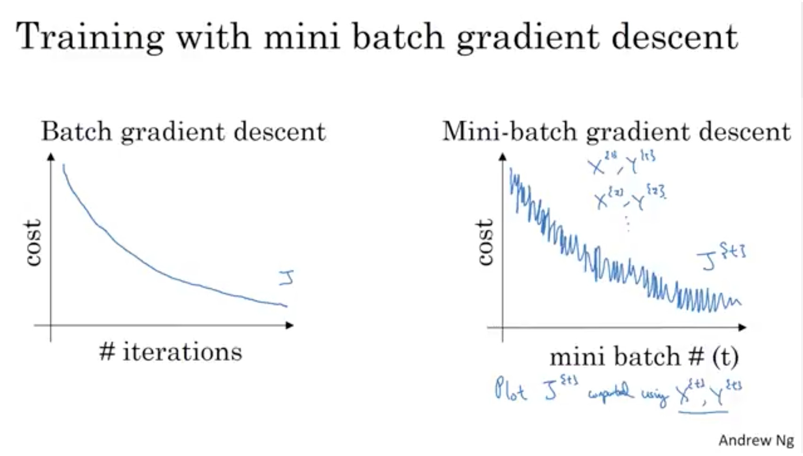
4. other benfit of this, if you have 100 million rows of data, to perform forward propagtion and backward propagation of this 100 millions of data, you just have to enject the 100 millions of data in your RAM, which itself give you out of memory. if i have take the data in batch let say 512 it will take very less space in RAM to process the data. now it don't mean how big is our data size.

### Batch size
* Batch size is choosen in such a way that 2 less in batch size will become very very noise and too bigger batch size defeat the purpose of fitting in memory.
* good batch size between 512 to 1024 for tabular and text data
* but if you deal with images(let say 2 MB per image size) 64 to 128 is good batch size.

### epoch
one epoch is define as a forward propagation and a backward propagation done on the entire set of data one time, weather you do it all at once or you send it in chunks, the epoch defination can not change.

### Demo of Batch size and epoch
when we do model.fit i call it batch_size=128, it is telling us that i once take 128 rows from the training set at random pass them through the forward progation using random set of weight using first iteration,
* calculate the loss
* update the weight
* using the updated weights i will randomly pick up next set of 128 rows of data from the training set, 
* send that through the model calculate the loss, update the weights
* now using the updated weight i will send 3re set of 128 rows of data, from randomly pick up from the training set, calculate the loss, update the weight and so on so forth.
```python
model.fit(x_train, y_train, validation_data=(x_val, y_val), epochs=10, batch_size=128, verbose=0, callbacks=[tb_callback])
```

`Q. how many times your weight get updated? if you have 10,000 data points, batch size is 200 and epoch is 20.`
Ans - In this scenario:
* Number of batches per epoch = Total data points / Batch size = 10,000 / 200 = 50
* Total weight updates per epoch = Number of batches per epoch = 50
* Total weight updates = Total weight updates per epoch * Number of epochs = 50 * 20 = 1000

So, the weights get updated 1000 times in total.

`Note : to less batch size make you loss curve very noise`

### Encoding method
Neural network hate categorical features, they can not deal with categorical feature, there is few way to deal with categorical feature.
1. One-hot encoding
2. Label encoding
3. Target encoding <br>
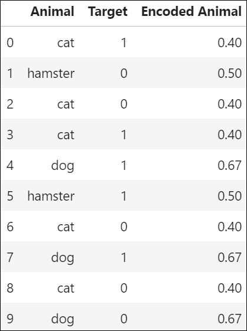 <br>
Python Implementation
```python
from category_encoders import TargetEncoder
enc = TargetEncoder(cols=['Warehouse_block', 'Mode_of_Shipment', 'Product_Importance','Gender']
X_val = enc.transform(X_val, y_val)
X_test = enc.transform(X_test, y_test)
X_train.head()
```
4. other.. cat boost encode

### Standardization (Standard Scaling)
Standard Scaling is very very useful. it solves 2 problem 
1. `Weight are not bloated`: it contolls the bloating of the weights and 
2. `Normalize the importance of all the features:` - certain feature get more importance and certain features not, it also can be controlled by standard scalling.

`Note: Standard Scaling is very underated things, it help in two thing first in bloating up the weights and also parcial overfitting under differnt features can be solved using standard scaling.`

## Batch Normalization
when i send scaled data to our neural network the input layer is experiensing scaled value, but what about the 5th hidden layer or 6th hidden layer, `Q. Is there any grantity that 5th scaled layer or 6th layer experience scaled valued?` <br>
Ans - There is no grantity that 5th hidden layer, 6th hidden layer experience scaled value.
input layer experience scaler value because i standard scaled it.

`Q. Do you think it is nessary steps that within the neural network i should also do some kind of scaling?`
Ans - That is what `batch normalization` help us to do. it also help us to explode the gradient descent.

-------------------------------------------------------------------------
Optimizers for NNs: <br>
Toppic : Batch Normalization, Optimiers
-------------------------------------------------------------------------
`Q. Dropout`: it is a layer. we kind of dropout random neuron during the tranining processs for each iteration such that it creates balanced form of learning for all neuron in neural network. <br>
`Q. When to use Dropout?` <br>
Ans - Dropout is used when you are building a deep neural network, and you have the noise in your data then you essentially make sure you have dropout layer in your data.<br>
`Q. How many dropout layer we should use?` <br>
Ans - We should not use too much dropout layer, we should use 2 or 3 dropout layer when we have 8 or 9 layers in our hidden layer. it kind of create robust network.<br>
`Q. Regulalization:` In regulalization we are saying, you can reduce the MSE but don't go on the cost of exploading the weights. just add some panalty to the loss function to avoid you weight to bloated up. <br>
-regulization is direct transformation at the loss function end <br>
`Q. Mini Batch Gradient descent`: take batch or chunks of data and calculate the loss and update the random weight. conversion of loss is very fast with respect to another gradient descent. in one epoch my weights get updated 100 times. how much data is to carry is hyperparameter.
`Q. what is optimzers`: the noraml gradient descent really do not have have power to handle such problems that a loss function handle. that's way we need optimizer.

### Batch Normalization
-standard scaling is very important propertity in neural network, the weights we have in our neural network should not bias towards anything the features should is unitless, why don't we maintain in the hidden layer also. <br>
let say we have a neural network and my input data is scaled preferly standard scaling, our X has to scaled so our Y also have to scaled. <br>
`Advantage`: this give us advantage that non of the features get advantage, all the features are in uniform kind of importance. `so there is no difference between units of the features`.

##### Experiment
* let's say you have diabetis dataset, you run an logistic regrssion on diabetis dataset and see the coefficent of logistic regression on unscaled data.
* next you scaled the data using standard scaling and then run a logistic regession then see the coefficent. and you will see the drastic difference in coefficent
* when you see in the coefficent on unscaled data you will se the coefficent in all over the data but when you see the coefficent of scaled data you will see much more stable like 1, -1, 1.9, .9.
* scaling have very very beautiful effects on the weight the weights are very much stable it do not bloaten up here and there.

`Q. when the data is scaled in the begining does it scaled going deeper?`
Ans - NO

`Q. You basically the scaled the data when you are feeding into the neural network but what happen in side the neural network within the hidden layer there is no scaling happening here? so you are giving advantage of weight in input layer that is great with what fault of 2nd hidden layer why it is not given scaled input into the system, what happen when you have very deep neural network, the 4th hidden layer will never get scaled input, why there is discrimination that you introduce the scaled value to input layer but you don't introudce the scaling to hidden layer?`
Ans - This is bed things, if we don't do this for all the layer then ultimatly the entire purpose get wasted, we have to introduce the scaling to entire layer. that requirment is handle by batch normalization. <br>

`Q. Using activation function will it give low value?`
Ans - Tenh does to its certain extend. it helps to scaling but not relu.

`Q. does dropout is use to drop high weight?`
Ans - No, Dropout is not for droping high weights it make sure that all the neuron learn in the similar fashion.

`Q. what effect we will see if we scaled at every point?`
Ans - if we scaled at every point we might loss the distribution

`Batch Normalization`: Batch normalization is basically a layer which is introduce after the dense layer. pupose of batch normalization is very very simple.
so, batch normalization is basically a scaling within the hidden layer.
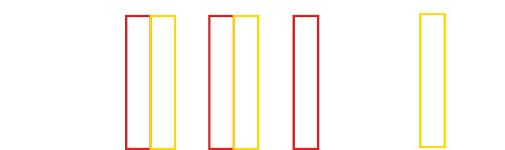

Layer that normalizes its inputs.

Batch normalization applies a transformation that maintains the mean output close to 0 and the output standard deviation close to 1.

Importantly, batch normalization works differently during training and during inference.

__During training__ (i.e. when using fit() or when calling the layer/model with the argument training=True), the layer normalizes its output using the mean and standard deviation of the current batch of inputs. That is to say, for each channel being normalized, the layer returns 
* ```gamma * (batch - mean(batch)) / sqrt(var(batch) + epsilon) + beta, where:```

    `epsilon` is small constant (configurable as part of the constructor arguments) <br>
    `gamma` is a learned scaling factor (initialized as 1), which can be disabled by passing scale=False to the constructor. <br>
    `beta` is a learned offset factor (initialized as 0), which can be disabled by passing center=False to the constructor.

__During inference__ (i.e. when using evaluate() or predict() or when calling the layer/model with the argument training=False (which is the default), the layer normalizes its output using a moving average of the mean and standard deviation of the batches it has seen during training. That is to say, it returns 
* ```gamma * (batch - self.moving_mean) / sqrt(self.moving_var+epsilon) + beta.```

    `self.moving_mean` and `self.moving_var` are non-trainable variables that are updated each time the layer in called in training mode, as such:

    `moving_mean` = moving_mean * momentum + mean(batch) * (1 - momentum)
    `moving_var` = moving_var * momentum + var(batch) * (1 - momentum)
    As such, the layer will only normalize its inputs during inference after having been trained on data that has similar statistics as the inference data.

### what is TensorFlow?
> Tensorflow is basically a neural network package which is design to build a neural network. but it has some learning curve
> Keras comes and say, I can create an API which is basically raper over tensorflow and the user is esserly be interacting with keras API, it is design in such a way that a user have very small or shello learning curve.
> In keras 3.0, keras also build a raper over pytorch, which makes even easy.

### Different layers we have: 
> Layer is basically transformation of the incomming data
1. __Core Layers__
    1. input layer
    1. Dense Layer
    1. Activation Layer
    1. Embedding Layer
    1. Masking Layer
    1. Lambda Layer
1. __Convolution Layers__
1. __Pooling Layers__   : used in images
1. __Recurrent Layers__ : used in nlp
1. __Preprocessing  Layers__
1. __Normalization  Layers__
1. __Regularization  Layers__
1. __Attention  Layers__ : Transformer model
1. __Reshaping  Layers__
1. __Activation  Layers__

### Denser Layer
A dense layer, also known as a fully connected layer, is a fundamental component of a neural network where each neuron in the layer is connected to every neuron in the preceding layer. It performs a linear operation followed by a non-linear activation function, allowing the network to learn complex relationships in the data.
```python
keras.layers.Dense(
    units,
    activation=None,
    use_bias=True,
    kernel_initializer="glorot_uniform",
    bias_initializer="zeros",
    kernel_regularizer=None,
    bias_regularizer=None,
    activity_regularizer=None,
    kernel_constraint=None,
    bias_constraint=None,
    **kwargs
)
```
 
```python
import tensorflow
import keras
from tensorflow.keras.models import Sequential
from tensorflow.keras.layers import Dense

# create an instance of sequential class; this is like a list now we need to add our layer,
model = Sequential()

# we added our hidden layer, the name of the hidden layer that keras identify is dense
# requirement of first Dense Layer, no of neuron, activation
# x.shape[1]- gives not of features we have
# relu and tanh both we can use but when to use what we don't know, it is hyperparamerter tunning

#input layer
model.add(Dense(units=10, activation='relu', input_shape=(x.shape[1],), name='hidden_1'))
#hidden layer
model.add(Dense(units=5, activation='tanh'), name='hidden_2') #no need to give input shape; since it is sequential it know input is comming from previous layer
#output layer
model.add(Dense(units=1, activation='linear'), name='Output') #units is depends upon type of problem we are solving, here i am solving regression problem so unit will be 1
#activation is linear; it is also know as pass-through; it return input unmodified
#by default is activation='linear'

```

### Optimizer
`one who participating vary strongly in gradient, we can slow him down, the neuron who is not participating at all in the loss reduction i need to boost it up, that is job of optimizer`. <br>
`Q. What are the problem of gradient descent alogorithm? or what problem does optimizer solve.` <br>
Ans - 
1. Multiple local minima
1. May not always converge to global minima. 
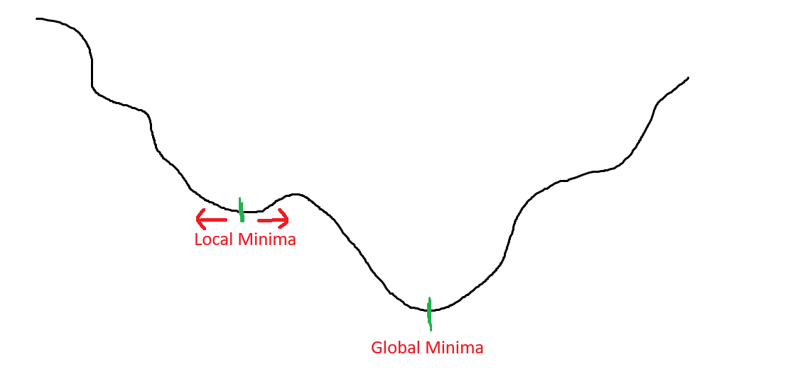
if you intilize the weight here then weights get settle here, he will say i achive the minima. this is not his problem, if he go left he will come opposite if he go right he will come opposite.
whatever i wanted he has done and stuck at local minima.
1. some time because of high learning rate i am not able to converge becuase i'm constatly rotating here and there.
1. because of bed initiliztion
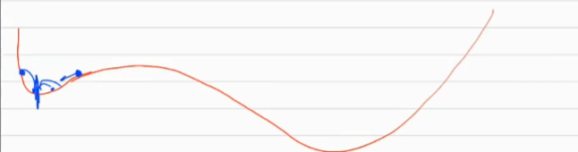


-An optimizer in the context of neural networks and machine learning is an algorithm used to minimize the loss function by adjusting the parameters (weights and biases) of the model during training. It determines how the model learns by updating these parameters in order to improve its performance over time. Common optimizers include stochastic gradient descent (SGD), Adam, RMSprop, and Adagrad, each with its own characteristics and advantages depending on the nature of the problem being solved.
### Gradient descent new weight updation.
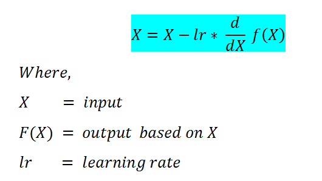

#### Topics in Optimizers
    1. Momentum
    2. Nestern of Accelated gradient with momentum
    3. Adagrade
    4. RMS Prop
    5. Adam

1. __Momentum__: use point gradient. take the historcal gradient and point gradent. 
* we use this when our loss curve is no smooth
* Arrive at global minima faster. 
* it also skip the small local minima.
* 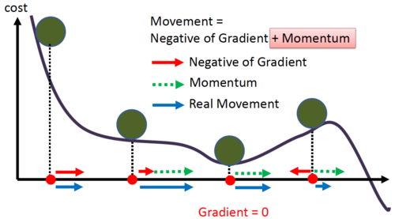
* gradient = hist + current gradient.

2. __Nestern of Accelated gradient with momentum__: use history of gradient, and look ahead

3. __Adagrade__: full form is adaptive gradient, your update of your weight is based on gradient decent update.

```python
momentum = keras.optimizers.SGD(
    learning_rate=0.01,
    momentum=0.5, #this is the momentum
    nesterov=False,
    weight_decay=None,
    clipnorm=None,
    clipvalue=None,
    global_clipnorm=None,
    use_ema=False,
    ema_momentum=0.99,
    ema_overwrite_frequency=None,
    name="SGD",
    **kwargs
)
```

## Callbacks
`Q. What is the purpose of callbacks?`
Ans - they want to monitor 'x' at the end of every epoch/batch, then do what with the monitoring?
1. Take a decision
2. Compute something

### Types of Callback
1. __Early stopping__: suppose you training a model and you have given 200 epoch. irrespective of epoch we don't want our model to learn till 200 epoch, it is a chances that our model give best model(weight) in between the jurney not at the end of the juerney. if i already go the best the best and we see that it is not imporving further then i should stop further training. <br>
__Decision 1:__ `whenever i got the best validation loss i should be able to save the weights corresponing to it.` <br>
__Decision 2:__ `if i got the best weight and i run n epoch to find the best of best weight then i should stop it`

__Early Stop:__ if my validation loss don't improve n number of epoch then i should stop. in other words if valiation loss does not improve(decrese) beyond a well defined threshold for an user defined number of epoch then i stop the training.
```python
keras.callbacks.EarlyStopping(
    monitor="val_loss",
    min_delta=0,
    patience=0,
    verbose=0,
    mode="auto",
    baseline=None,
    restore_best_weights=False,
    start_from_epoch=0,
)
```
* if an imporovement is less then certain delta and at certain epoch(patience) i will stop the model.
Stop training when a monitored metric has stopped improving.

Assuming the goal of a training is to minimize the loss. With this, the metric to be monitored would be 'loss', and mode would be 'min'. A model.fit() training loop will check at end of every epoch whether the loss is no longer decreasing, considering the min_delta and patience if applicable. Once it's found no longer decreasing, model.stop_training is marked True and the training terminates.

The quantity to be monitored needs to be available in logs dict. To make it so, pass the loss or metrics at model.compile().

Arguments
1. __monitor__: Quantity to be monitored. Defaults to "val_loss".
2. __min_delta__: Minimum change in the monitored quantity to qualify as an improvement, i.e. an absolute change of less than min_delta, will count as no improvement. Defaults to 0.
3. __patience__: Number of epochs with no improvement after which training will be stopped. Defaults to 0.
4. __verbose__: Verbosity mode, 0 or 1. Mode 0 is silent, and mode 1 displays messages when the callback takes an action. Defaults to 0.
5. __mode__: One of {"auto", "min", "max"}. In min mode, training will stop when the quantity monitored has stopped decreasing; in "max" mode it will stop when the quantity monitored has stopped increasing; in "auto" mode, the direction is automatically inferred from the name of the monitored quantity. Defaults to "auto".
6. __baseline__: Baseline value for the monitored quantity. If not None, training will stop if the model doesn't show improvement over the baseline. Defaults to None.
7. __restore_best_weights__: Whether to restore model weights from the epoch with the best value of the monitored quantity. If False, the model weights obtained at the last step of training are used. An epoch will be restored regardless of the performance relative to the baseline. If no epoch improves on baseline, training will run for patience epochs and restore weights from the best epoch in that set. Defaults to False.
8. __start_from_epoch__: Number of epochs to wait before starting to monitor improvement. This allows for a warm-up period in which no improvement is expected and thus training will not be stopped. Defaults to 0.

#### Example
```python
callback = keras.callbacks.EarlyStopping(monitor='loss', patience=3)
# This callback will stop the training when there is no improvement in
# the loss for three consecutive epochs.
model = keras.models.Sequential([keras.layers.Dense(10)])
model.compile(keras.optimizers.SGD(), loss='mse')
history = model.fit(np.arange(100).reshape(5, 20), np.zeros(5), epochs=10, batch_size=1, callbacks=[callback], verbose=0)
len(history.history['loss'])  # Only 4 epochs are run.
```

### Model-checkpoint callback
Irrespective of weather i am using early stopping or not, whenever my model has least validation loss i should save that point, that is acheive through model checkpoint checkpoints.
```python
keras.callbacks.ModelCheckpoint(
    filepath,
    monitor="val_loss",
    verbose=0,
    save_best_only=False,
    save_weights_only=False,
    mode="auto",
    save_freq="epoch",
    initial_value_threshold=None,
)
```

Callback to save the Keras model or model weights at some frequency.

ModelCheckpoint callback is used in conjunction with training using model.fit() to save a model or weights (in a checkpoint file) at some interval, so the model or weights can be loaded later to continue the training from the state saved.

A few options this callback provides include:
* Whether to only keep the model that has achieved the "best performance" so far, or whether to save the model at the end of every epoch regardless of performance.
* Definition of "best"; which quantity to monitor and whether it should be maximized or minimized.
* The frequency it should save at. Currently, the callback supports saving at the end of every epoch, or after a fixed number of training batches.
* Whether only weights are saved, or the whole model is saved.

```python
model.compile(loss=..., optimizer=..., metrics=['accuracy'])

EPOCHS = 10
checkpoint_filepath = '/tmp/ckpt/checkpoint.model.keras'
model_checkpoint_callback = keras.callbacks.ModelCheckpoint(
    filepath=checkpoint_filepath,
    monitor='val_accuracy',
    mode='max',
    save_best_only=True)

# Model is saved at the end of every epoch, if it's the best seen so far.
model.fit(epochs=EPOCHS, callbacks=[model_checkpoint_callback])

# The model (that are considered the best) can be loaded as -
keras.models.load_model(checkpoint_filepath)

# Alternatively, one could checkpoint just the model weights as -
checkpoint_filepath = '/tmp/ckpt/checkpoint.weights.h5'
model_checkpoint_callback = keras.callbacks.ModelCheckpoint(
    filepath=checkpoint_filepath,
    save_weights_only=True,
    monitor='val_accuracy',
    mode='max',
    save_best_only=True)

# Model weights are saved at the end of every epoch, if it's the best seen
# so far.
model.fit(epochs=EPOCHS, callbacks=[model_checkpoint_callback])

# The model weights (that are considered the best) can be loaded as -
model.load_weights(checkpoint_filepath)
```

### Learning Rate Scheduler Callback
It make you model converge smoother, you will see less abration to tail end.
```python
keras.callbacks.LearningRateScheduler(schedule, verbose=0)
```
At the beginning of every epoch, this callback gets the updated learning rate value from schedule function provided at __init__, with the current epoch and current learning rate, and applies the updated learning rate on the optimizer.

Arguments

1. __schedule__: A function that takes an epoch index (integer, indexed from 0) and current learning rate (float) as inputs and returns a new learning rate as output (float).
1. __verbose__: Integer. 0: quiet, 1: log update messages.
Example

```python
>>> # This function keeps the initial learning rate for the first ten epochs
>>> # and decreases it exponentially after that.
>>> def scheduler(epoch, lr):
...     if epoch < 10:
...         return lr
...     else:
...         return lr * ops.exp(-0.1)
>>>
>>> model = keras.models.Sequential([keras.layers.Dense(10)])
>>> model.compile(keras.optimizers.SGD(), loss='mse')
>>> round(model.optimizer.learning_rate, 5)
0.01
```

```python
>>> callback = keras.callbacks.LearningRateScheduler(scheduler)
>>> history = model.fit(np.arange(100).reshape(5, 20), np.zeros(5),
...                     epochs=15, callbacks=[callback], verbose=0)
>>> round(model.optimizer.learning_rate, 5)
0.00607
```

### TensorBoard Callback
Tensorboard is another callback, it is just a visualization tools, it is fancy way to show how weights are moving, how train validation loss is moving.

### compile function
This line of code is from a Python script using TensorFlow or a similar deep learning framework for model compilation. 

- `loss='mean_squared_error'`: This specifies the loss function to be used during training, which measures the difference between the predicted values and the actual values. In this case, it's using mean squared error, which is commonly used for regression problems.

- `optimizer=sgd`: This specifies the optimizer algorithm to be used for training the model. 'sgd' likely refers to stochastic gradient descent, a popular optimization algorithm used to minimize the loss function and update the model's parameters iteratively during training.

- `metrics=['r2', 'mae']`: This specifies additional metrics to be evaluated during training and testing. 'r2' likely refers to the coefficient of determination (R^2), which measures the proportion of the variance in the dependent variable that is predictable from the independent variables. 'mae' stands for mean absolute error, another metric commonly used for regression problems, which measures the average absolute difference between the predicted and actual values.
```python
# in the compilation code we have to make 3 important aspects;
#loss, optimzer(gradient descent), metrics
model.compile(loss='mean_squared_error', optimizer=sgd, metrics=['r2', 'mae'])
#We can use loss as a metric but visa versa is not possible
```

### fit function
```python
model.fit(X,y, epochs=100, validation_data=0.2)
#after every iteration i will use the weight to calculate and predict the value, and use the validation to check and verify how closer or far we are
#after every epochs, you will be able to monitor the training loss 
```
### log loss and class weight
  + if small loss in minority class it will increase, loss for miniority class will be height because of giving class weight.


### Relu vs Leaky Relu


### Train Test Split

```python
from sklearn.model_selection import train_test_split

X_dev, X_test, y_dev, y_test = train_test_split(X, y, test_size=0.1, random_state=42)
X_train, X_val, y_train, y_val = train_test_split(X_dev, y_dev, test_size=0.1, random_state=42)

print('train :', X_train.shape, y_train.shape)
print('test  :', X_test.shape, y_test.shape)
print('val   :', X_val.shape, y_val.shape)
```

### Standard Scaler
  Q. why do we split first and then scale, why can we scale and then split.
  + let's say we scaler entire data, and then we perform the split, in this case the mean and Standard deviation of data get known by test and validate data, which is not good.
  + best practice: first we need to split and then scaler the value.
  + to prevent it from data leaking, because of mean value of training data
  Q. Why do we need scale on x and do we need scaling on y?
  + it will make everything unit less
  + Now, in the case of classification problem we don't need to perform scaling but in the regression problem do we need to scale the y.
  + if you y is very high then there is not problem in scaling. example: house pricing, car prices, or millions
  + sometime it will give out of memory error if your value is very high, then you loss will be huge.

```python
from sklearn.preprocessing import StandardScaler
scaler = StandardScaler
X_train = scaler.fit_transform(X_train)
X_test = scaler.transfrom(X_test)
X_val = scaler.transfrom(X_val)
```   

### Simple Model
```python
model = Sequential([
                    Dense(64, activation="relu", input_shape=(11,), name="hidden_1"),
                    Dense(4, activation="softmax", name="output")
])
model.summary()
```

### Model: "sequential_4"
_________________________________________________________________
 Layer (type)                Output Shape              Param #   
=================================================================
 hidden_1 (Dense)            (None, 64)                768       
                                                                 
 output (Dense)              (None, 4)                 260       
                                                                 
=================================================================
Total params: 1028 (4.02 KB)
Trainable params: 1028 (4.02 KB)
Non-trainable params: 0 (0.00 Byte)
_________________________________________________________________

### Model Summary
from tensorflow.keras.utils import plot_model

plot_model(model,
    to_file='model.png',
    show_shapes=True, show_layer_names=True)
    

> forward propegation, calculate the loss
> backard propegation, update the weights

### Fit model
```python
%%time
history = model.fit(X_train, y_train, epochs=500, batch_size=256, validation_split=0.1, verbose=1)

#return the probability of 4 class
pred = model.predict(X_val)

#find the actural class
np.argmax(pred)

# Plot histograms of weight and bias values after training
import matplotlib.pyplot as plt
fig, axes = plt.subplots(3, 2, figsize=(5,5))
fig.subplots_adjust(hspace=0.5, wspace=0.5)

# get the weights from the layers
weight_layers = [layer for layer in model.layers]

for i, layer in enumerate(weight_layers):
    for j in [0, 1]:
        axes[i, j].hist(layer.weights[j].numpy().flatten(), align='left')
        axes[i, j].set_title(layer.weights[j].name)
```


> Lets look at the history object dictionary. It's an alternative to dir().
`__dict__` attribute can be used to retrieve all the keys associated with the object on which it is called.

>history.__dict__.keys()
dict_keys(['validation_data', 'model', '_chief_worker_only', '_supports_tf_logs', 'history', 'params', 'epoch'])

>history.history.keys()
dict_keys(['loss', 'accuracy', 'val_loss', 'val_accuracy'])

```python
epochs = history.epoch
loss = history.history["loss"]
accuracy = history.history["accuracy"]
val_loss = history.history["val_loss"]
val_accuracy = history.history["val_accuracy"]

plt.figure()
plt.plot(epochs, loss, label="train")
plt.plot(epochs, val_loss, label="val")
plt.legend()
plt.title("Loss VS Epochs")
plt.show()

plt.figure()
plt.plot(epochs, accuracy, label="train")
plt.plot(epochs, val_accuracy, label="validation")
plt.legend()
plt.title("Accuracy VS Epochs")
plt.show()
```

### Log Loss(Categorical Cross Entropy) vs Sparse Categorical Cross Entropy

+ y^ = [0.2 0.7 0.1]    y = [1 0 0] --> One hot Encoding
+ y^ = [0.2 0.7 0.1]    y = 1       --> Categorical <br>

* _Option1_: Either you use simple `label encoding` and `Sparse Categorical Cross Entropy`
* _Option2_: or you use `one hot encoding` and `Sparse Categorical Cross Entropy`
------------------------------------------
  Hyperparameter Tuning for NNs
------------------------------------------

## Autoencoders using Neural Networks
`Q. What is the purpose of Autoencoders?` <br>
Ans - In a given data there is some deterministic pattern + noise.
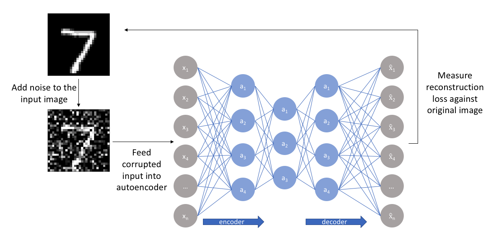
input is same as output, so it learn clean form of data. this entire system become noise remover system. 

`Q. what is low dimention representation?` <br>
Ans - when we have sparse data then we go for low dimenation represenations. the whole purpose the low dimenstion representatioln is to redicate or remove unnessary information, that is the entire purpose of low dimentional represenation. so low dimenational repesentation is ment to loss data. and it is generally done when we have sparse data.

#### Application

**1. Dimensionality Reduction/ Compression**
Here, compression doesn't mean reducing the space
- but to reduce the number of features of input vectors

Reducing the dimensions means
- faster inference time
- low latency
We can also use these embeddings for visualization

**2. Denoising**
We can use AE (Autoencoders) to denoise the data

**3. Embeddings**

We can use AE to generate embeddings
- These embeddings can be used for
    - recommender system
    - clustering
    - image search

### implementation of Autoencoders
```python
import keras
from keras import layers
from keras.datasets import mnist
import numpy as np

(x_train, y_train), (x_test, y_test) = mnist.load_data()

#Normalization of input
x_train = x_train.astype('float32') / 255.
x_test = x_test.astype('float32') / 255.

#Reshaping the images to 1D vectors
x_train = x_train.reshape((len(x_train), np.prod(x_train.shape[1:])))
x_test = x_test.reshape((len(x_test), np.prod(x_test.shape[1:])))

#AutoEncoder model - Functional
input_img = keras.Input(shape=(784,))
encoded = layers.Dense(128, activation='relu')(input_img)
encoded = layers.Dense(64, activation='relu')(encoded)
encoded = layers.Dense(32, activation='relu')(encoded)

decoded = layers.Dense(64, activation='relu')(encoded)
decoded = layers.Dense(128, activation='relu')(decoded)
decoded = layers.Dense(784, activation='sigmoid')(decoded)

autoencoder = keras.Model(input_img, decoded)
autoencoder.compile(optimizer='adam', loss='binary_crossentropy')

autoencoder.fit(x_train, x_train,
                epochs=10,
                batch_size=256,
                shuffle=True,
                validation_data=(x_test, x_test))

```
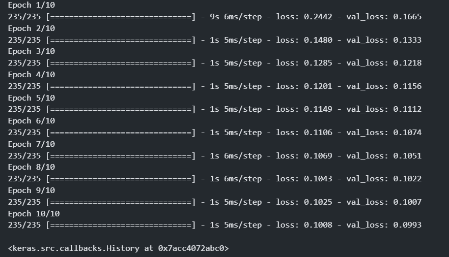

```python
autoencoder.summary()
```
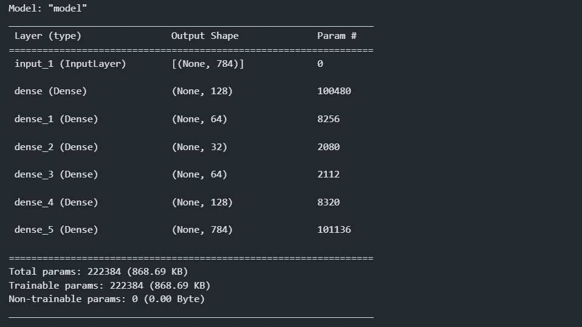

### Remove the noise from image
```python
#AutoEncoder model
input_img = keras.Input(shape=(784,))
encoded = layers.Dense(128, activation='relu')(input_img)
encoded = layers.Dense(64, activation='relu')(encoded)
encoded = layers.Dense(32, activation='relu')(encoded)

decoded = layers.Dense(64, activation='relu')(encoded)
decoded = layers.Dense(128, activation='relu')(decoded)
decoded = layers.Dense(784, activation='sigmoid')(decoded)

# Compile and Fit
autoencoder = keras.Model(input_img, decoded)
autoencoder.compile(optimizer='adam', loss='binary_crossentropy')

autoencoder.fit(x_train_noisy, x_train, # NOTE: input is noisy, output is non-noisy
                epochs=100,
                batch_size=256,
                shuffle=True,
                validation_data=(x_test_noisy, x_test))
```
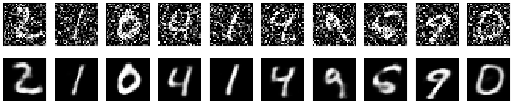

## Recommender System using AE

similarity between movies vs movies and user vs user