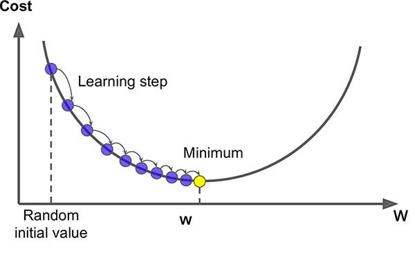
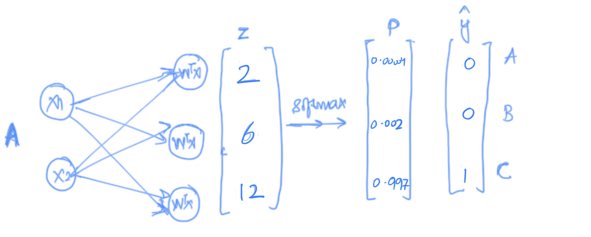
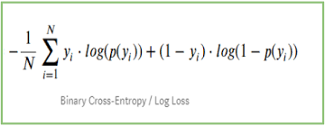
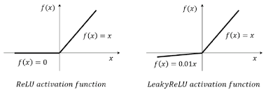
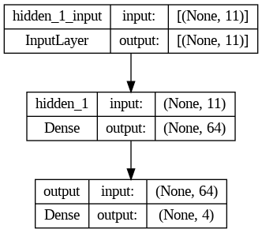
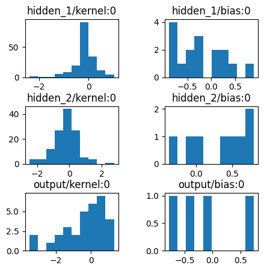

# Introduction to Neural Network

## What is Deep Learning?
- Deep Learning is basically a field of study where in we use something known as neurons for traing the data.
- for example, we teach a baby how to identify the cat or dog or car.
- Automated Feature Engineering.
- In Machine Learning need data in feature space such as x1, x2, x3... 
- Where as Deep Learning No need of Featurization.
- Deep Learning can Extract the feature from Image, Text, Tabula data, Audio, Video, etc. it automatically extract information.
> **New Definition:** Deep Learning is basically a mathematical techinique that enable us to extract infromation from any kind of structured/unstructured data using the concept of neuron.

- $$ Y = f(x) $$ 
    
    This data(x) can be Tabular/graph/video/Audio/Text/Image etc; we can give any kind of data and we can do any kind of prediction. the only kind we need to understand which architure of f or which deep learning techinique we should use in this case, this is the power of Deep Learning.
- if we design is arthitecure of f in proper manner, we can solve any kind of problem.

- Q. You are saying that data can be anything, but you also saying that function the deep learning algorithm should be articureize according to the data, can you tell what type of data vs what type of archtecure works.
- ans. that is why different deep learning techinques exist.

## Different Deep Learning Techinques.
1. **Artifical Neural Network** - This type of neural network are design to extract infomation from tabular data. like csv file.
2. **Convolution Neural Network** - This type of neural network are design to extract infomation from image data.
3. **Recurent Neural Network(LSTM/GRU/Transformers)** - This type of neural network are design to extract information from squence data(like text, audio, Videos).
    - RNN has many class model such as LSTM(long short term memeory/GRU)
    - Tranformers are like a part of RNN for Squence data. ex - chatGPT
4. **Graph Neural Network** - for Graphs(molecule)

### Multi-Modality: 
- Multi-Modality is a concept where single functioncan take data from multiple sources, I can take tablular data, image data, text data together, etc. not the enemble or average out of model, together mean join of all the data.
- All the infromation from multiple possible resouces, just like human brain, our brain is desion multi-modal. 
- for example; To understand anything I can use visual, i can see the object, I can smell etc.
- taking infomation from multiple sources.
- think of medical data; test, X-rays, ECG(time series data) that is what multi-modelity. make decision depended on the differnt join input.

#### important points
- take text --> generate an image(stable deffusion model)
- take image --> generate the text (captioning model)
- take text --> and generate a video(Runway company doing that)

### Why Deep Learning vs Machine Learning?
- for example: predicting secand hand car24, you are not only using tablular data but also image of car, inspection command, service history, or other comments. to pridict the price of second hand car. which machine learning can not do, this is the beauti of deep learning.

#### Desision Tree also partiting the data neural network also partiting the data it is like a black box, but we know that how decision tree partiting, verticle lines and horizontal line, but we don't know, how neural network is partiting the data, it is partiting in small small peaces and find the curve. (but there are way to tell us)

### Why the non-linearlity is absolutely vital?

<p align="center">
  
</p>

$$
 n_1 = x_1w_1 + x_2w_2 + wo 
$$

$$
 n_2 = x_1w_3 + x_2w_4 + wo
$$

$$
    w_1, w_2, w_3, w_4 --> these thing decide my slope, and when it pass to the non-linearity it will decide my curvature
$$

$$
 y^{ \wedge } = w_5n_1 + w_6n_2 + wb
$$

$$
 y^{ \wedge } = w_5(x_1w_1 + x_2w_2 + wo) + w_6(x_1w_3 + x_2w_4 + wo) + wb
$$

$$
 y^{ \wedge } = w_5x_1w_1 + w_5x_2w_2 + w_5wo + w_6x_1w_3 + w_6x_2w_4 + w_6wo + wb
$$

- collect all the x1, x2, wb

$$
 y^{ \wedge } = x_1(w_5w_1 + w_6w_3) + x_2(w_5w_2 + w_6w_4) + w_5wo  + w_6wo + wb
$$

- it's a line:

$$
 y^{ \wedge } = x_1A + x_2B + C
$$

- if we add any kind of non linearity then the megic will happen.
- this is the beauti, 1 neuron doing the simple task but when you join simple, simple, ... task to data i will become big and solve bigger problem.

$$
 n_1 = \tanh\left(x_1w_1 + x_2w_2 + wo\right)
$$

$$
 n_2 = \tanh\left(x_1w_3 + x_2w_4 + wo\right)
$$

- That is a single curvatue of the a line can fit any decision boundary

## How do we train such a network of neurons:
1. Intilise the architecure (define the number of hidden layers, neurons etc)
1. Randomly Intilise the weight
1. Given the weights calculate the loss:-
    * how do i calculate the loss of regression problem? 
        MSE = (1/n) * Σ(yᵢ - ŷᵢ)²
        Where:
        - n is the number of observations,
        - yᵢ is the actual value for the i-th observation,
        - ŷᵢ is the predicted value for the i-th observation.
1. Given the loss, update the weithts- Gradient Descent Algorithm + Chain Rule
1. using the updated weights go to step3 and keep on doing it till you stablise your training loss to the min possible(min val loss)

# Gradient Descent Algothim and Chain Rule
- Gradient will have some problems and that where we will be learning optimizers; it is meant to improve the gradient descent problem.


## what is the job of single Neuron?
> Neuron get some input along with the weights and bias and generate some output.

## what exactly a neural network?
- Neural network a basically a concept where in we are connecting multiple small small mathematic unit together in such a way they can fit any kind of decision boundry. 
- the way it is doing, the one neuron is resposible for small single job.
- one neuron is doing a very simple job.
- the objective of one neuron in life is, that i certain inputs comming inside me and i give them certain weight, i combine inputs with weights and bias to generate some output.
- y = x1xW1 + x2xW2 + w0 
- neuron is resposible for decision boundary
- you need to design a framework that i can form any kind of non-linearity, given any kind of function i can fit that or any kind of dimension.
- this can acheive be only acheive by 2 things, one is that if i divide the entire boundary in small small subsegments and each subsegment is single non-linearity then at a network i can fit a complex decision boundary.

### why the non-linerity is absolutely vital?
- it is difficult for me to estimate the boundary in totality, but it is easier for me to estimate in joing diffent differnt curve.

### Question: I understood that we have some input varible which multiply by some weights and again in hidden layer it again multiply by some weights and product some output. How can this weight is find out?
- it is solved by gradient descent

## How do we train such a network of neurons?
 1. Initalise the architecure(define the number of hidden layers, neurons etc)
 1. Randomly initialise the weights
 1. Given the weights calculate the loss
 1. Given the loss, update the weights- Gradient descent Algorithm + Chain Rule
 1. using the updated weights go to step 3 and keep on doing it till you stabilise your training loss to the min possible(min val loss)

(One *Forword Propagation*: given random weight we forward propagates, and get the loss. calculate from left to right)


## what is loss?
- Loss is a function that define the difference between the actural and predicted.
- basic properties of loss function-
    + should be continues
    + should be diffential
    + should be exist in such a way it has only one minimum, convex optimzation(only one minimum)
    + The Mean Squared Error (MSE) is a commonly used loss function in regression problems to measure the average squared difference between the predicted values and the actual values. This loss function is particularly useful when the goal is to minimize the average squared error of predictions.
    + The formula for Mean Squared Error is given by:

        \[ MSE = \frac{1}{n} \sum_{i=1}^{n} (y_i - \hat{y}_i)^2 \]

        where:
        - \( n \) is the number of samples.
        - \( y_i \) is the actual value of the i-th sample.
        - \( \hat{y}_i \) is the predicted value of the i-th sample.

## What is the loss in binary classification
Cross-Entropy Loss, often referred to as *Log Loss*, is a widely used loss function in classification problems. It measures the performance of a classification model whose output is a probability value between 0 and 1.

#### Binary Cross-Entropy Loss Formula
    The formula for Binary Cross-Entropy Loss is given by:

    \[ BCE = -\frac{1}{N} \sum_{i=1}^{N} \left( y_i \cdot \log(\hat{y}_i) + (1 - y_i) \cdot \log(1 - \hat{y}_i) \right) \]

    where:
    - \( N \) is the number of samples.
    - \( y_i \) is the true label of the i-th sample (1 for positive, 0 for negative).
    - \( \hat{y}_i \) is the predicted probability of the i-th sample being in the positive class.

#### Categorical Cross-Entropy Loss Formula
    For multi-class classification, the Categorical Cross-Entropy Loss is used. The formula is given by:

    \[ CCE = -\frac{1}{N} \sum_{i=1}^{N} \sum_{j=1}^{C} y_{i,j} \cdot \log(\hat{y}_{i,j}) \]

    where:
    - \( N \) is the number of samples.
    - \( C \) is the number of classes.
    - \( y_{i,j} \) is the indicator function (1 if sample \( i \) belongs to class \( j \), 0 otherwise).
    - \( \hat{y}_{i,j} \) is the predicted probability of the i-th sample belonging to class \( j \).

#### Interpretation
- Cross-Entropy Loss is used to measure the dissimilarity between the true distribution and the predicted distribution.
- Lower Cross-Entropy Loss values indicate better model performance.

#### Considerations
- Cross-Entropy Loss is sensitive to the correctness of class probabilities predicted by the model.
- It penalizes confidently wrong predictions more than uncertain ones.

### forward propagation and backword propagation
+ given the weight calculate the loss, is called forward propagation
+ given the loss update the weight, is called backward propagation

### How to update the weight, is there any logic behind how to update the weight or any algorithm is there to update the weights. 
- There is an algorithm that is called Gradient Descent Algorithm

## Grandient Descent Algorithm
+ given the loss how do i update the weight for regression problem, for classification problem and for multiclass classification problem.
+ Loss is the function which are present in multi-dimenstion; how many dimention; number of weights and bias
+ starts with random weights

+ so from here, we calculate the partical derivties of loss with respect to w1
    - what is partical derivates; if the increse our w1 slightly, w1+dw, what will happen to my loss.
    - DL/w1: optimize in the direction of w1
    1. in case of regression problem - [output: acivation] [function, LOSS: MSE]
    1. in case of classification problem(binary) - [output: sigmoid], [LOSS: binary Log Loss]
    1. in case of Multi-classification problem - [output: softmax], [LOSS: multiclass logloss]
        * One-vs-Rest - if you have 3 class in you neuron then there is 3 output, each output contain the probabilty of output.
        * but how do i make sure each of the three neuron are between 0 to 1 and all of them together add up to 1.
        * through an activation function called Softmax
        * softmax takes any value of n, not that only it return the probabilty of each output(between 0 to 1) and total add up to 1.
        
    * use one-hot-encoding not label-encoding for multiclass classification.

### why can't we use metrices for updating the loss?
 - Metrices are use for majoring the performance, we can not find the loss.
 - also it is not differentiable

## TensorFlow and keras
    - tool and platform that i can use my neural network at simpler way.

### The loss curve that we get in neural network can be very very difficult to optimize, what are the tool and technique in our pocket to make my neural network better in training.
    - Dropout,
    - Batch Normalization
    - Regulization
    - optimzer
    - callback
    - hyperparamerter Tunning
> these are my mathematical animation so that we can create our neural network in more refine way.

### what is TensorFlow?
> Tensorflow is basically a neural network package which is design to build a neural network. but it has some learning curve
> Keras comes and say, I can create an API which is basically raper over tensorflow and the user is esserly be interacting with keras API, it is design in such a way that a user have very small or shello learning curve.
> In keras 3.0, keras also build a raper over pytorch, which makes even easy.

### Different layers we have: 
> Layer is basically transformation of the incomming data
1. __Core Layers__
    1. input layer
    1. Dense Layer
    1. Activation Layer
    1. Embedding Layer
    1. Masking Layer
    1. Lambda Layer
1. __Convolution Layers__
1. __Pooling Layers__   : used in images
1. __Recurrent Layers__ : used in nlp
1. __Preprocessing  Layers__
1. __Normalization  Layers__
1. __Regularization  Layers__
1. __Attention  Layers__ : Transformer model
1. __Reshaping  Layers__
1. __Activation  Layers__

### Denser Layer
```python
keras.layers.Dense(
    units,
    activation=None,
    use_bias=True,
    kernel_initializer="glorot_uniform",
    bias_initializer="zeros",
    kernel_regularizer=None,
    bias_regularizer=None,
    activity_regularizer=None,
    kernel_constraint=None,
    bias_constraint=None,
    **kwargs
)
```
 
```python
import tensorflow
import keras
from tensorflow.keras.models import Sequential
from tensorflow.keras.layers import Dense

# create an instance of sequential class; this is like a list now we need to add our layer,
model = Sequential()

# we added our hidden layer, the name of the hidden layer that keras identify is dense
# requirement of first Dense Layer, no of neuron, activation
# x.shape[1]- gives not of features we have
# relu and tanh both we can use but when to use what we don't know, it is hyperparamerter tunning

#input layer
model.add(Dense(units=10, activation='relu', input_shape=(x.shape[1],), name='hidden_1'))
#hidden layer
model.add(Dense(units=5, activation='tanh'), name='hidden_2') #no need to give input shape; since it is sequential it know input is comming from previous layer
#output layer
model.add(Dense(units=1, activation='linear'), name='Output') #units is depends upon type of problem we are solving, here i am solving regression problem so unit will be 1
#activation is linear; it is also know as pass-through; it return input unmodified
#by default is activation='linear'

```

### Optimizer
```python
sgd = keras.optimizers.SGD(
    learning_rate=0.01,
    momentum=0.0,
    nesterov=False,
    weight_decay=None,
    clipnorm=None,
    clipvalue=None,
    global_clipnorm=None,
    use_ema=False,
    ema_momentum=0.99,
    ema_overwrite_frequency=None,
    name="SGD",
    **kwargs
)
```
### compile function
```python
# in the compilation code we have to make 3 important aspects;
#loss, optimzer(gradient descent), metrics
model.compile(loss='mean_squared_error', optimizer=sgd, metrics=['r2', 'mae'])
#We can use loss as a metric but visa versa is not possible
```

### fit function
```python
model.fit(X,y, epochs=100, validation_data=0.2)
#after every iteration i will use the weight to calculate and predict the value, and use the validation to check and verify how closer or far we are
#after every epochs, you will be able to monitor the training loss 
```
### log loss and class weight
  + if small loss in minority class it will increase, loss for miniority class will be height because of giving class weight.


### Relu vs Leaky Relu


### Train Test Split

```python
from sklearn.model_selection import train_test_split

X_dev, X_test, y_dev, y_test = train_test_split(X, y, test_size=0.1, random_state=42)
X_train, X_val, y_train, y_val = train_test_split(X_dev, y_dev, test_size=0.1, random_state=42)

print('train :', X_train.shape, y_train.shape)
print('test  :', X_test.shape, y_test.shape)
print('val   :', X_val.shape, y_val.shape)
```

### Standard Scaler
  Q. why do we split first and then scale, why can we scale and then split.
  + let's say we scaler entire data, and then we perform the split, in this case the mean and Standard deviation of data get known by test and validate data, which is not good.
  + best practice: first we need to split and then scaler the value.
  + to prevent it from data leaking, because of mean value of training data
  Q. Why do we need scale on x and do we need scaling on y?
  + it will make everything unit less
  + Now, in the case of classification problem we don't need to perform scaling but in the regression problem do we need to scale the y.
  + if you y is very high then there is not problem in scaling. example: house pricing, car prices, or millions
  + sometime it will give out of memory error if your value is very high, then you loss will be huge.

```python
from sklearn.preprocessing import StandardScaler
scaler = StandardScaler
X_train = scaler.fit_transform(X_train)
X_test = scaler.transfrom(X_test)
X_val = scaler.transfrom(X_val)
```   

### Simple Model
```python
model = Sequential([
                    Dense(64, activation="relu", input_shape=(11,), name="hidden_1"),
                    Dense(4, activation="softmax", name="output")
])
model.summary()
```

### Model: "sequential_4"
_________________________________________________________________
 Layer (type)                Output Shape              Param #   
=================================================================
 hidden_1 (Dense)            (None, 64)                768       
                                                                 
 output (Dense)              (None, 4)                 260       
                                                                 
=================================================================
Total params: 1028 (4.02 KB)
Trainable params: 1028 (4.02 KB)
Non-trainable params: 0 (0.00 Byte)
_________________________________________________________________

### Model Summary
from tensorflow.keras.utils import plot_model

plot_model(model,
    to_file='model.png',
    show_shapes=True, show_layer_names=True)
    

> forward propegation, calculate the loss
> backard propegation, update the weights

### Fit model
```python
%%time
history = model.fit(X_train, y_train, epochs=500, batch_size=256, validation_split=0.1, verbose=1)

# Plot histograms of weight and bias values after training
import matplotlib.pyplot as plt
fig, axes = plt.subplots(3, 2, figsize=(5,5))
fig.subplots_adjust(hspace=0.5, wspace=0.5)

# get the weights from the layers
weight_layers = [layer for layer in model.layers]

for i, layer in enumerate(weight_layers):
    for j in [0, 1]:
        axes[i, j].hist(layer.weights[j].numpy().flatten(), align='left')
        axes[i, j].set_title(layer.weights[j].name)
```


> Lets look at the history object dictionary. It's an alternative to dir().
`__dict__` attribute can be used to retrieve all the keys associated with the object on which it is called.

>history.__dict__.keys()
dict_keys(['validation_data', 'model', '_chief_worker_only', '_supports_tf_logs', 'history', 'params', 'epoch'])

>history.history.keys()
dict_keys(['loss', 'accuracy', 'val_loss', 'val_accuracy'])

```python
epochs = history.epoch
loss = history.history["loss"]
accuracy = history.history["accuracy"]
val_loss = history.history["val_loss"]
val_accuracy = history.history["val_accuracy"]

plt.figure()
plt.plot(epochs, loss, label="train")
plt.plot(epochs, val_loss, label="val")
plt.legend()
plt.title("Loss VS Epochs")
plt.show()

plt.figure()
plt.plot(epochs, accuracy, label="train")
plt.plot(epochs, val_accuracy, label="validation")
plt.legend()
plt.title("Accuracy VS Epochs")
plt.show()
```


### Log Loss(Categorical Cross Entropy) vs Sparse Categorical Cross Entropy

+ y^ = [0.2 0.7 0.1]    y = [1 0 0] --> One hot Encoding
+ y^ = [0.2 0.7 0.1]    y = 1       --> Categorical

