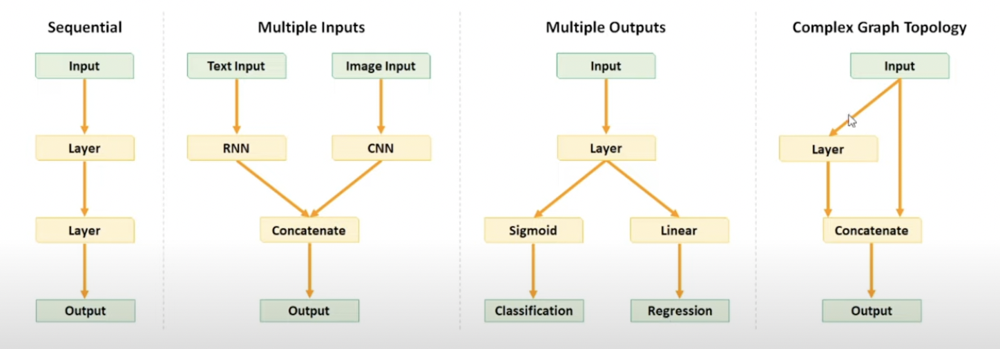

# Introduction to Neural Network

## What is Deep Learning?
- Deep Learning is basically a field of study where in we use something known as neurons for traing the data.
- for example, we teach a baby how to identify the cat or dog or car.
- Automated Feature Engineering.
- In Machine Learning need data in feature space such as x1, x2, x3... 
- Where as Deep Learning No need of Featurization.
- Deep Learning can Extract the feature from Image, Text, Tabula data, Audio, Video, etc. it automatically extract information.
> **New Definition:** Deep Learning is basically a mathematical techinique that enable us to extract infromation from any kind of structured/unstructured data using the concept of neuron.

- $$ Y = f(x) $$ 
    
    This data(x) can be Tabular/graph/video/Audio/Text/Image etc; we can give any kind of data and we can do any kind of prediction. the only kind we need to understand which architure of f or which deep learning techinique we should use in this case, this is the power of Deep Learning.
- if we design is arthitecure of f in proper manner, we can solve any kind of problem.

- Q. You are saying that data can be anything, but you also saying that function the deep learning algorithm should be articureize according to the data, can you tell what type of data vs what type of archtecure works.
- ans. that is why different deep learning techinques exist.

## Different Deep Learning Techinques.
1. **Artifical Neural Network** - This type of neural network are design to extract infomation from tabular data. like csv file.
2. **Convolution Neural Network** - This type of neural network are design to extract infomation from image data.
3. **Recurent Neural Network(LSTM/GRU/Transformers)** - This type of neural network are design to extract information from squence data(like text, audio, Videos).
    - RNN has many class model such as LSTM(long short term memeory/GRU)
    - Tranformers are like a part of RNN for Squence data. ex - chatGPT
4. **Graph Neural Network** - for Graphs(molecule)

### Multi-Modality: 
- Multi-Modality is a concept where single functioncan take data from multiple sources, I can take tablular data, image data, text data together, etc. not the enemble or average out of model, together mean join of all the data.
- All the infromation from multiple possible resouces, just like human brain, our brain is desion multi-modal. 
- for example; To understand anything I can use visual, i can see the object, I can smell etc.
- taking infomation from multiple sources.
- think of medical data; test, X-rays, ECG(time series data) that is what multi-modelity. make decision depended on the differnt join input.

#### important points
- take text --> generate an image(stable deffusion model)
- take image --> generate the text (captioning model)
- take text --> and generate a video(Runway company doing that)

### Why Deep Learning vs Machine Learning?
- for example: predicting secand hand car24, you are not only using tablular data but also image of car, inspection command, service history, or other comments. to pridict the price of second hand car. which machine learning can not do, this is the beauti of deep learning.

#### Desision Tree also partiting the data neural network also partiting the data it is like a black box, but we know that how decision tree partiting, verticle lines and horizontal line, but we don't know, how neural network is partiting the data, it is partiting in small small peaces and find the curve. (but there are way to tell us)

### Why the non-linearlity is absolutely vital?

<p align="center">
  
</p>

$$
 n_1 = x_1w_1 + x_2w_2 + wo 
$$

$$
 n_2 = x_1w_3 + x_2w_4 + wo
$$

$$
    w_1, w_2, w_3, w_4 --> these thing decide my slope, and when it pass to the non-linearity it will decide my curvature
$$

$$
 y^{ \wedge } = w_5n_1 + w_6n_2 + wb
$$

$$
 y^{ \wedge } = w_5(x_1w_1 + x_2w_2 + wo) + w_6(x_1w_3 + x_2w_4 + wo) + wb
$$

$$
 y^{ \wedge } = w_5x_1w_1 + w_5x_2w_2 + w_5wo + w_6x_1w_3 + w_6x_2w_4 + w_6wo + wb
$$

- collect all the x1, x2, wb

$$
 y^{ \wedge } = x_1(w_5w_1 + w_6w_3) + x_2(w_5w_2 + w_6w_4) + w_5wo  + w_6wo + wb
$$

- it's a line:

$$
 y^{ \wedge } = x_1A + x_2B + C
$$

- if we add any kind of non linearity then the megic will happen.
- this is the beauti, 1 neuron doing the simple task but when you join simple, simple, ... task to data i will become big and solve bigger problem.

$$
 n_1 = \tanh\left(x_1w_1 + x_2w_2 + wo\right)
$$

$$
 n_2 = \tanh\left(x_1w_3 + x_2w_4 + wo\right)
$$

- That is a single curvatue of the a line can fit any decision boundary

## How do we train such a network of neurons:
1. Intilise the architecure (define the number of hidden layers, neurons etc)
1. Randomly Intilise the weight
1. Given the weights calculate the loss:-
    * how do i calculate the loss of regression problem? 
        MSE = (1/n) * Σ(yᵢ - ŷᵢ)²
        Where:
        - n is the number of observations,
        - yᵢ is the actual value for the i-th observation,
        - ŷᵢ is the predicted value for the i-th observation.
1. Given the loss, update the weithts- Gradient Descent Algorithm + Chain Rule
1. using the updated weights go to step3 and keep on doing it till you stablise your training loss to the min possible(min val loss)

# Gradient Descent Algothim and Chain Rule
- Gradient will have some problems and that where we will be learning optimizers; it is meant to improve the gradient descent problem.


## what is the job of single Neuron?
> Neuron get some input along with the weights and bias and generate some output.

## what exactly a neural network?
- Neural network a basically a concept where in we are connecting multiple small small mathematic unit together in such a way they can fit any kind of decision boundry. 
- the way it is doing, the one neuron is resposible for small single job.
- one neuron is doing a very simple job.
- the objective of one neuron in life is, that i certain inputs comming inside me and i give them certain weight, i combine inputs with weights and bias to generate some output.
- y = x1xW1 + x2xW2 + w0 
- neuron is resposible for decision boundary
- you need to design a framework that i can form any kind of non-linearity, given any kind of function i can fit that or any kind of dimension.
- this can acheive be only acheive by 2 things, one is that if i divide the entire boundary in small small subsegments and each subsegment is single non-linearity then at a network i can fit a complex decision boundary.

### why the non-linerity is absolutely vital?
- it is difficult for me to estimate the boundary in totality, but it is easier for me to estimate in joing diffent differnt curve.

### Question: I understood that we have some input varible which multiply by some weights and again in hidden layer it again multiply by some weights and product some output. How can this weight is find out?
- it is solved by gradient descent

## How do we train such a network of neurons?
 1. Initalise the architecure(define the number of hidden layers, neurons etc)
 1. Randomly initialise the weights
 1. Given the weights calculate the loss
 1. Given the loss, update the weights- Gradient descent Algorithm + Chain Rule
 1. using the updated weights go to step 3 and keep on doing it till you stabilise your training loss to the min possible(min val loss)

(One *Forword Propagation*: given random weight we forward propagates, and get the loss. calculate from left to right)


## what is loss?
- Loss is a function that define the difference between the actural and predicted.
- basic properties of loss function-
    + should be continues
    + should be diffential
    + should be exist in such a way it has only one minimum, convex optimzation(only one minimum)
    + The Mean Squared Error (MSE) is a commonly used loss function in regression problems to measure the average squared difference between the predicted values and the actual values. This loss function is particularly useful when the goal is to minimize the average squared error of predictions.
    + The formula for Mean Squared Error is given by:

        
        

## What is the loss in binary classification
Cross-Entropy Loss, often referred to as *Log Loss*, is a widely used loss function in classification problems. It measures the performance of a classification model whose output is a probability value between 0 and 1.

### Binary Cross-Entropy Loss Formula

The formula for Binary Cross-Entropy Loss is given by:


where:

- \( N \) is the number of samples.
- \( y_i \) is the true label of the i-th sample (1 for positive, 0 for negative).
- \( \hat{y}_i \) is the predicted probability of the i-th sample being in the positive class.


### Categorical Cross-Entropy Loss Formula
For multi-class classification, the Categorical Cross-Entropy Loss is used. The formula is given by:


where:
- \( N \) is the number of samples.
- \( C \) is the number of classes.
- \( y_{i,j} \) is the indicator function (1 if sample \( i \) belongs to class \( j \), 0 otherwise).
- \( \hat{y}_{i,j} \) is the predicted probability of the i-th sample belonging to class \( j \).

#### Interpretation
- Cross-Entropy Loss is used to measure the dissimilarity between the true distribution and the predicted distribution.
- Lower Cross-Entropy Loss values indicate better model performance.

#### Considerations
- Cross-Entropy Loss is sensitive to the correctness of class probabilities predicted by the model.
- It penalizes confidently wrong predictions more than uncertain ones.

### forward propagation and backword propagation
+ given the weight calculate the loss, is called forward propagation
+ given the loss update the weight, is called backward propagation

### How to update the weight, is there any logic behind how to update the weight or any algorithm is there to update the weights. 
- There is an algorithm that is called Gradient Descent Algorithm

## Grandient Descent Algorithm
+ given the loss how do i update the weight for regression problem, for classification problem and for multiclass classification problem.
+ Loss is the function which are present in multi-dimenstion; how many dimention; number of weights and bias
+ starts with random weights

+ so from here, we calculate the partical derivties of loss with respect to w1
    - what is partical derivates; if the increse our w1 slightly, w1+dw, what will happen to my loss.
    - DL/w1: optimize in the direction of w1
    1. in case of regression problem - [output: linear acivation function], [LOSS: MSE]
    1. in case of classification problem(binary) - [output: sigmoid], [LOSS: binary Log Loss]
    1. in case of Multi-classification problem - [output: softmax], [LOSS: multiclass logloss]
        * One-vs-Rest - if you have 3 class in you neuron then there is 3 output, each output contain the probabilty of output.
        * but how do i make sure each of the three neuron are between 0 to 1 and all of them together add up to 1.
        * through an activation function called Softmax
        * softmax takes any value of n, not that only it return the probabilty of each output(between 0 to 1) and total add up to 1.
        
    * use one-hot-encoding not label-encoding for multiclass classification.

# Activation Functions for Different Types of Problems
## Activation Function
An activation function is a mathematical operation applied to each neuron's output in a neural network, introducing non-linearity to the model. It allows the network to learn complex patterns and relationships in the data by transforming the input signals into an output signal. Activation functions help in capturing and representing the hierarchical structures in the data, making neural networks capable of approximating complex functions and solving a wide range of problems.

## Regression Problems
- **Linear Activation Function**: Suitable for unbounded output.
- **ReLU (Rectified Linear Unit)**: Commonly used, but may not be suitable for negative predictions.
- **Leaky ReLU**: Variant of ReLU that allows a small gradient for negative inputs.
- **ELU (Exponential Linear Unit)**: Smooth alternative to ReLU, allowing negative values.
- **Tanh (Hyperbolic Tangent)**: Squashes output to [-1, 1], suitable for bounded outputs.
- **Softplus**: Smooth approximation of ReLU, allowing negative values.
- **Sigmoid**: Sometimes used when output needs to be bounded between 0 and 1.

## Binary Classification Problems
- **Sigmoid Activation Function**: Outputs a probability for the positive class.
- **Binary Step (Threshold) Activation Function**: Less common, outputs 1 or 0 based on a threshold.
- **Softmax**: Rarely used, but can be employed for binary classification with two output units.

## Multiclass Classification Problems
- **Softmax Activation Function**: Normalizes output into a probability distribution over multiple classes.
- **Sigmoid Activation Function per Class**: One-vs-all strategy, multiple sigmoid functions for each class.
- **Sparse Categorical Cross-Entropy Loss**: No activation function on output layer, combined with cross-entropy loss.
- **Softmax with Negative Log-Likelihood Loss**: Often used in frameworks like PyTorch, softmax followed by negative log-likelihood loss.


### why can't we use metrices for updating the loss?
 - Metrices are use for majoring the performance, we can not find the loss.
 - also it is not differentiable

## Tensorflow and Keras - 1 (Fri, 22 Dec 2023)
    - tool and platform that i can use my neural network at simpler way.

#### 1. Sequential API
- When input data is flow from one input to one output in a stream line way.
- one input some hidden layer and one output.
- The __Sequential model__, which is very straightforward (a simple list of layers), but is limited to single-input, single-output stacks of layers (as the name gives away).
- `one input mean 1 type of data like data having 10 features`
`When we have one image data and one tabular data there we need a functional API. here sequential api will not work here.`

#### 2. Functional API
- multiple input and multiple output
- `When we have one image data and one tabular data there we need a functional API`.
- Medical data problem, we don't only see bio marks we also see the test result, etc.
- basically multimodel model, input are coming in different way. that is why we need to import our input layer.

#### Question: Can you design this model using Keras Sequential API ?
- No, there is no way to pass two inputs to one layer in Sequential API
- We use another API of Keras called as Functional API to design such complex models

#### Why do we need Functional API instead of Sequential API?

- Functional API gives us **more flexibility**
- This API can handle **multiple inputs and outputs**
- lets say we have an image and a text description as our training data
- Or we want model to output two or more target variables
- Ex- A weather forecast model predicting Min & Max temp at the same time
- Sequential API wont be able to do this


Look at this complex model design, it can not be created using Sequential API but easily by Functional API
- Multiple inputs to one layer
- Multiple outputs of one layer

- So functional api gives us more **flexibility for network architectures**
- architectures are not always in sequential manner
- we can have two layers in parallel  
- It is always recommend to **use the simplest method while building networks**
- Simple models can be easily built with Sequential API
- But sometimes we need the flexibility


#### Sequential API
```python
from tensorflow.keras.layers import Dense
from tensorflow.keras.models import Sequential
model_sequential = Sequential([
                    Dense(16, activation="relu", input_shape=(11,), name="hidden_1"),
                    Dense(8, activation="relu", name="hidden_2"),
                    Dense(4, activation="softmax", name="output")
])
```
- Earlier we have created this model using Sequential API
- Now lets create same model using Functional API

#### Functional API
- Multiple Sources of data coming together that is way i specifically bring the input layer explicityly.
- now, what i do with this input layer, in my input layer now, i can create the input layer sapartly.
- In Sequential we passed input shape in the first layer
- But Here we will be using an additional layer : **Input layer**
- we're going to explicitly have a separate layer to represent the data input.
- so, i can create individual input layers to ingest differnt types of data in my neural network.
```python
from tensorflow.keras.layers import Input
# create an input layer with the shape of the dataframe
inp1 = Input(shape=(11,))
inp2=Input(shape=(5,))
```
### Complicated:
- I can put tabluar data, image data and text data in one single neural network and then generate the output.
- `Q. why can't we do seperatly, we train image data seperatly, we train text data seperatily and we do tabular data seperatly`
- ans - And when a new patient will come i can send the x-ray, ct-scan seperatly, i can send report seperatly and i can send precription seperatelty to the model and then take the average it and generate the average probability
### what is the Difference between ensamble model and multimodel?
- ans - `Sudipta: the model will not learn the association between each type of input if we don't use multi model approch.` <br>
- ans - the model will not learn the join distribution, given the blood report and the scan and the text together, we need to learn `join distribution` of 3 things not individual. <br>
- `ensemble will not able to learn the join distribution, it will learn conditional distribution, i will learn independent distribution.`
```
- Next we will be creating our first two layer of the model
- Instead of creating a list (as in Sequential)
- We will also pass previous layer in the current layer
- In first dense `hidden_1` we will pass `inp`
- And in second `hidden_1` we will pass `hidden_2`
```
```python
h1 = Dense(16, activation="relu", name="hidden_1")(inp1)
h2 = Dense(4, activation="relu", name="hidden_2")(h1)
out1 = Dense(4, activation="softmax", name="output")(h2)

h3=Dense(4,activation="tanh" name="hidden_3")(inp2)
out2=Dense(1, name="output")(h3)
```


- Finally,  to built a model using this directed graph
- We will use `tf.keras.models.Model`, and pass all the inputs and outputs
```python
from tensorflow.keras.models import Model
model_functional = Model(inputs=[inp1,inp2], outputs=[out1,out2], name="simple_nn")
```

using the same above architecure we can apply `regression` and `classificaiton` at one go.  <br>
- `we can stack layers in no sequential manner.` <br>
- new it is up to you what kind of problem you can solve using this arrangement of layers.


`Q. What is facial recogntion can do? we can solve the face comparision using this method.` <br>
what facial recongition do, it has an image1 and image2, both pass through same set of layers and generates two vectors and then calcuate the cosine similarity of these two vector and prediction of 1 and 0 


`Q. Image and tabular data, how it look like in multi-modality.`


`Q. Image data, tabular data and Text data multimodel`
functional api is not about join 2 or more models it is about the ability to combine two information from multiple sources/layers.


`note: Sudipto, i have given you machansim/framework now you think about the combination`

You can make inceptionnet with this framework.


`Image similarity problem`: I process the image with the same steps and generate two vectors. i can not subtract the image1 to image2 i have to learn the 1 dimentional representation of these images and then do cosine similarity. <br>
- we can not do element wise operation on this 2 image, we need to have some 1 dimentational representation then we can perform image similarity.
- we are using the same artichiture to create the 1-dimentational vector because if we use different articecture then we get different set of 1-d vectors, which cause problem when we do cosine similarity.
- that is why architecure design is thoughtfull processs i can't able to make in 1 or 2 day.
- 1-dementional vector is gold pot of that image.


> Note: it doesn't matter what kind of data you bring in, but last layer is alway be dense laye, weather it is ANN, CNN, or RNN. after doing any kind of feature extration on tabular,video, Audio, Graph, image or text it will always end up with 1-dimentional data, which can be handle by dense layer.

### Build a fuctional API
```python
from tensorflow.keras.layers import Input
inp1 = Input(shape=(11,))
inp2 = Input(shape=(5,))

h1 = Dense(16, activation="relu", name="hidden_1")(inp1)
h2 = Dense(4, activation="relu", name="hidden_2")(h1)
h3=Dense(4,activation="tanh" name="hidden_3")(inp2)

# final output
out1 = Dense(4, activation="softmax", name="output")(h2)
out2=Dense(1, name="output")(h3)
```

- We have defined the flow of the model
- Finally,  to built a model using this directed graph
- We will use `tf.keras.models.Model`, and pass all the inputs and outputs

```python
from tensorflow.keras.models import Model
model_functional = Model(inputs=[inp1,inp2], outputs=[out1,out2], name="simple_nn")
```

Let's generalize above code inside a function
```python
from tensorflow.keras.models import Model
from tensorflow.keras.layers import Input
def create_model_functional():
    inp = Input(shape=(11,))

    h1 = Dense(16, activation="relu", name="hidden_1")(inp)
    h2 = Dense(8 , activation="relu", name="hidden_2")(h1)

    out = Dense(4, activation="softmax", name="output")(h2)

    model = Model(inputs=inp, outputs=out, name="simple_nn")
    return model
```
```python
model_functional = create_model_functional()
```
```python
model_functional.summary()
```

And, optionally, display the input and output shapes of each layer in the plotted graph:

```python
tf.keras.utils.plot_model(model_functional,show_shapes=True)
```
### let's create a little complex model using functional API's with more than one output
optimizer will be same because we can not have more then 1 gradient descent to adjust the weights.
```python
def create_model_multiple_output():
  inp = Input(shape=(11,))

  h1 = Dense(16, activation="relu", name="hidden_1")(inp)
  h2 = Dense(8 , activation="relu", name="hidden_2")(h1)
  h3 = Dense(4 , activation="relu", name="hidden_3")(h2)

  out1 = Dense(1, activation="sigmoid", name="output1")(h3)
  out2 = Dense(1, activation="linear", name="output2")(h3)

  model = Model(inputs=inp, outputs=[out1,out2], name="simple_nn")
  return model

# instade of string identifier i can also provide class object
mse=tk.keras.loss.mean_squared_error()

# creating model with multiple output
model_multiple_output = create_model_multiple_output()
model_multiple_output.compile(
    optimizer = tf.keras.optimizers.Adam(learning_rate=0.001),
    loss = {"output1":"binarycross_entropy", "output2":mse}, #string identifier, class object
    metrics=["accuracy"])

# plotting model with multiple output
tf.keras.utils.plot_model(model_multiple_output,show_shapes=True)
```

#### You can make a model with multiple output with
1. the Functional API
1. by subclassing tf.keras.Model.

Here's an example of dual outputs (regression and classification) on the Iris Dataset, using the Functional API:
```python
from sklearn.datasets import load_iris
from tensorflow.keras.layers import Dense
from tensorflow.keras import Input, Model
import tensorflow as tf

data, target = load_iris(return_X_y=True)
X = data[:, (0, 1, 2)]
Y = data[:, 3]
Z = target

inputs = Input(shape=(3,), name='input')
x = Dense(16, activation='relu', name='16')(inputs)
x = Dense(32, activation='relu', name='32')(x)

# bifercate, 1 dense for regression and 1 dense for classification
output1 = Dense(1, name='cont_out')(x) #regression output
output2 = Dense(3, activation='softmax', name='cat_out')(x)  #classificition output

model = Model(inputs=inputs, outputs=[output1, output2])

model.compile(loss={'cont_out': 'mean_absolute_error', 
                    'cat_out': 'sparse_categorical_crossentropy'},
              optimizer='adam',
              metrics={'cat_out': tf.metrics.SparseCategoricalAccuracy(name='acc')})

history = model.fit(X, {'cont_out': Y, 'cat_out': Z}, epochs=10, batch_size=8)
```
during the backpropagation you have to consider for both losses net loss(J1+J2) and update the weight accordingly.<br>
you can also do 
```python
history = model.fit(X, [Y,Z], epochs=10, batch_size=8)
```
### The loss curve that we get in neural network can be very very difficult to optimize, what are the tool and technique in our pocket to make my neural network better in training.
    - Dropout,
    - Batch Normalization
    - Regulization
    - different optimzers
    - callback
    - hyperparamerter Tunning
> these are my mathematical animation so that we can create our neural network in more refine way.

## Dropout

- image a situation you are a teacher and you have 50 student, and each student has differnt IQ, differnt brain, different attension spam, let say the teacher asked a question and let's say there are 3 student in the first banch who actively answer all the question. 
- here, what happen the 3 student are training very well but other 47 student are not paying attension. 
- now you send this 50 student to a competition, what will be the performance of the class? bed right, because only 3 student do well in that group, in that competion independly they have to perform well.
- what could be teacher do to import this?
    * special attension
    * parent teacher meeting
    * extra class
- suppose:
    * Teacher - loss
    * 50 Students - neurons
    * Cold calling(randomly asking question) - Dropout


- now, some neauron have the perfect weight assign, those neuron who having the perfect weight can perform well just like first bancher and the entire set of neuron are relay on those 3 neuron for loss reduction.
- now here the teacher is feeling good, that whatever he is teaching everyone is getting well. but the teach don't know the other 47 student is not doing good.
- It mean the entire class the doing good because of 3 front bancher and minimize the loss of entire class by these 3 student. this is like training
- but when these student send to the competion then they perform really bad.
- `Note: here you are seeing that loss is reducing by the cost of other neuron not learning well. you will observer that your training loss reducing very well but you test loss is not reducing well.`
- `Basically, we are training 50 neural network but there are only 3 neural network which are responsible for reducing loss.`
- `Dropout` is local phenomena not global phenomana. dropout is apply on layer wise.
- i do a coin toss(mean it either stay or not stay in certain probability) if it come up to `head` i will drop that neuron and remove all the connection related to that neuron. <br>
    * it is like you don't have to dependent on your friend you solve it by yourself. it is forcing the neuron to get train by flowing entire information.
    * it make sure all neuron have participated in training process and there is no strong relience on one specific set of neurons, because if they where absent other guys have to learn. this crated very robust form of neural network. and make your class very stronger.
- you can also set a dropout rate(=0.3) it means that for every training there is 30% chances that the neuron get dropout and 70% changes that each neuron is not going to drop.
- after every epoch the neural network connection is back.

- every neuron participate in training.
- `Note: one neuron can learn only the one feature not entire feature`
- how many neauron we can drop in one layer is __hyperparmeter__.
- dropout rate is __hyperparmeter__ usually 0.2 or 0.3 is good.
- `Note: we can't do dense+dropout, dense + dropout, we usually do 2 or 3 dense layer then 1 dropout layer.`

* Q. if all the incoming neuron connection is 0 then that neuron is good for nothing.<br>
Ans: if the neuron weight is closer to zero then i can say it is inactive,

* `Note: dropout helps to reduces overfitting.`
* Objective of dropout:
    - every neuron should learn individually
    - without depending on other

```python
model.add(dense(2), activation='relu')
model.add(dropout(dropout rate=0.2))
```

### what is TensorFlow?
> Tensorflow is basically a neural network package which is design to build a neural network. but it has some learning curve
> Keras comes and say, I can create an API which is basically raper over tensorflow and the user is esserly be interacting with keras API, it is design in such a way that a user have very small or shello learning curve.
> In keras 3.0, keras also build a raper over pytorch, which makes even easy.

### Different layers we have: 
> Layer is basically transformation of the incomming data
1. __Core Layers__
    1. input layer
    1. Dense Layer
    1. Activation Layer
    1. Embedding Layer
    1. Masking Layer
    1. Lambda Layer
1. __Convolution Layers__
1. __Pooling Layers__   : used in images
1. __Recurrent Layers__ : used in nlp
1. __Preprocessing  Layers__
1. __Normalization  Layers__
1. __Regularization  Layers__
1. __Attention  Layers__ : Transformer model
1. __Reshaping  Layers__
1. __Activation  Layers__

### Denser Layer
A dense layer, also known as a fully connected layer, is a fundamental component of a neural network where each neuron in the layer is connected to every neuron in the preceding layer. It performs a linear operation followed by a non-linear activation function, allowing the network to learn complex relationships in the data.
```python
keras.layers.Dense(
    units,
    activation=None,
    use_bias=True,
    kernel_initializer="glorot_uniform",
    bias_initializer="zeros",
    kernel_regularizer=None,
    bias_regularizer=None,
    activity_regularizer=None,
    kernel_constraint=None,
    bias_constraint=None,
    **kwargs
)
```
 
```python
import tensorflow
import keras
from tensorflow.keras.models import Sequential
from tensorflow.keras.layers import Dense

# create an instance of sequential class; this is like a list now we need to add our layer,
model = Sequential()

# we added our hidden layer, the name of the hidden layer that keras identify is dense
# requirement of first Dense Layer, no of neuron, activation
# x.shape[1]- gives not of features we have
# relu and tanh both we can use but when to use what we don't know, it is hyperparamerter tunning

#input layer
model.add(Dense(units=10, activation='relu', input_shape=(x.shape[1],), name='hidden_1'))
#hidden layer
model.add(Dense(units=5, activation='tanh'), name='hidden_2') #no need to give input shape; since it is sequential it know input is comming from previous layer
#output layer
model.add(Dense(units=1, activation='linear'), name='Output') #units is depends upon type of problem we are solving, here i am solving regression problem so unit will be 1
#activation is linear; it is also know as pass-through; it return input unmodified
#by default is activation='linear'

```

### Optimizer
An optimizer in the context of neural networks and machine learning is an algorithm used to minimize the loss function by adjusting the parameters (weights and biases) of the model during training. It determines how the model learns by updating these parameters in order to improve its performance over time. Common optimizers include stochastic gradient descent (SGD), Adam, RMSprop, and Adagrad, each with its own characteristics and advantages depending on the nature of the problem being solved.
```python
sgd = keras.optimizers.SGD(
    learning_rate=0.01,
    momentum=0.0,
    nesterov=False,
    weight_decay=None,
    clipnorm=None,
    clipvalue=None,
    global_clipnorm=None,
    use_ema=False,
    ema_momentum=0.99,
    ema_overwrite_frequency=None,
    name="SGD",
    **kwargs
)
```
### compile function
This line of code is from a Python script using TensorFlow or a similar deep learning framework for model compilation. 

- `loss='mean_squared_error'`: This specifies the loss function to be used during training, which measures the difference between the predicted values and the actual values. In this case, it's using mean squared error, which is commonly used for regression problems.

- `optimizer=sgd`: This specifies the optimizer algorithm to be used for training the model. 'sgd' likely refers to stochastic gradient descent, a popular optimization algorithm used to minimize the loss function and update the model's parameters iteratively during training.

- `metrics=['r2', 'mae']`: This specifies additional metrics to be evaluated during training and testing. 'r2' likely refers to the coefficient of determination (R^2), which measures the proportion of the variance in the dependent variable that is predictable from the independent variables. 'mae' stands for mean absolute error, another metric commonly used for regression problems, which measures the average absolute difference between the predicted and actual values.
```python
# in the compilation code we have to make 3 important aspects;
#loss, optimzer(gradient descent), metrics
model.compile(loss='mean_squared_error', optimizer=sgd, metrics=['r2', 'mae'])
#We can use loss as a metric but visa versa is not possible
```

### fit function
```python
model.fit(X,y, epochs=100, validation_data=0.2)
#after every iteration i will use the weight to calculate and predict the value, and use the validation to check and verify how closer or far we are
#after every epochs, you will be able to monitor the training loss 
```
### log loss and class weight
  + if small loss in minority class it will increase, loss for miniority class will be height because of giving class weight.


### Relu vs Leaky Relu


### Train Test Split

```python
from sklearn.model_selection import train_test_split

X_dev, X_test, y_dev, y_test = train_test_split(X, y, test_size=0.1, random_state=42)
X_train, X_val, y_train, y_val = train_test_split(X_dev, y_dev, test_size=0.1, random_state=42)

print('train :', X_train.shape, y_train.shape)
print('test  :', X_test.shape, y_test.shape)
print('val   :', X_val.shape, y_val.shape)
```

### Standard Scaler
  Q. why do we split first and then scale, why can we scale and then split.
  + let's say we scaler entire data, and then we perform the split, in this case the mean and Standard deviation of data get known by test and validate data, which is not good.
  + best practice: first we need to split and then scaler the value.
  + to prevent it from data leaking, because of mean value of training data
  Q. Why do we need scale on x and do we need scaling on y?
  + it will make everything unit less
  + Now, in the case of classification problem we don't need to perform scaling but in the regression problem do we need to scale the y.
  + if you y is very high then there is not problem in scaling. example: house pricing, car prices, or millions
  + sometime it will give out of memory error if your value is very high, then you loss will be huge.

```python
from sklearn.preprocessing import StandardScaler
scaler = StandardScaler
X_train = scaler.fit_transform(X_train)
X_test = scaler.transfrom(X_test)
X_val = scaler.transfrom(X_val)
```   

### Simple Model
```python
model = Sequential([
                    Dense(64, activation="relu", input_shape=(11,), name="hidden_1"),
                    Dense(4, activation="softmax", name="output")
])
model.summary()
```

### Model: "sequential_4"
_________________________________________________________________
 Layer (type)                Output Shape              Param #   
=================================================================
 hidden_1 (Dense)            (None, 64)                768       
                                                                 
 output (Dense)              (None, 4)                 260       
                                                                 
=================================================================
Total params: 1028 (4.02 KB)
Trainable params: 1028 (4.02 KB)
Non-trainable params: 0 (0.00 Byte)
_________________________________________________________________

### Model Summary
from tensorflow.keras.utils import plot_model

plot_model(model,
    to_file='model.png',
    show_shapes=True, show_layer_names=True)
    

> forward propegation, calculate the loss
> backard propegation, update the weights

### Fit model
```python
%%time
history = model.fit(X_train, y_train, epochs=500, batch_size=256, validation_split=0.1, verbose=1)

#return the probability of 4 class
pred = model.predict(X_val)

#find the actural class
np.argmax(pred)

# Plot histograms of weight and bias values after training
import matplotlib.pyplot as plt
fig, axes = plt.subplots(3, 2, figsize=(5,5))
fig.subplots_adjust(hspace=0.5, wspace=0.5)

# get the weights from the layers
weight_layers = [layer for layer in model.layers]

for i, layer in enumerate(weight_layers):
    for j in [0, 1]:
        axes[i, j].hist(layer.weights[j].numpy().flatten(), align='left')
        axes[i, j].set_title(layer.weights[j].name)
```


> Lets look at the history object dictionary. It's an alternative to dir().
`__dict__` attribute can be used to retrieve all the keys associated with the object on which it is called.

>history.__dict__.keys()
dict_keys(['validation_data', 'model', '_chief_worker_only', '_supports_tf_logs', 'history', 'params', 'epoch'])

>history.history.keys()
dict_keys(['loss', 'accuracy', 'val_loss', 'val_accuracy'])

```python
epochs = history.epoch
loss = history.history["loss"]
accuracy = history.history["accuracy"]
val_loss = history.history["val_loss"]
val_accuracy = history.history["val_accuracy"]

plt.figure()
plt.plot(epochs, loss, label="train")
plt.plot(epochs, val_loss, label="val")
plt.legend()
plt.title("Loss VS Epochs")
plt.show()

plt.figure()
plt.plot(epochs, accuracy, label="train")
plt.plot(epochs, val_accuracy, label="validation")
plt.legend()
plt.title("Accuracy VS Epochs")
plt.show()
```


### Log Loss(Categorical Cross Entropy) vs Sparse Categorical Cross Entropy

+ y^ = [0.2 0.7 0.1]    y = [1 0 0] --> One hot Encoding
+ y^ = [0.2 0.7 0.1]    y = 1       --> Categorical

